# mongodb-backend-nodejs

## 前言
> 作为学习mongodb后台服务编程的demo项目，从0到1搭建相应的代码目录框架。
> 并以此来提升关于`nodejs`学习的熟悉程度

## 目录结构说明
```
mongodb-backend-nodejs
├── .env
├── .eslintignore
├── .eslintrc.json
├── .gitignore
├── .nvmrc
├── .prettierignore
├── .prettierrc
├── assets 本地说明文档所需图片资源
├── commitlint.config.cjs
├── config
│  ├── db-connection.ts 统一的数据库连接器
│  ├── token-generator.ts 统一的token生成器，包括访问token以及刷新token
│  └── uploader-generator.ts 统一的文件上传配置生成器，用于统一配置文件上传
├── control  业务逻辑的控制器
│  ├── brand-controller.ts	品牌控制器
│  ├── cate-controller.ts	分类控制器
│  ├── file-controller.ts	文件资源控制器
│  ├── order-controller.ts	订单控制器
│  ├── product-controller.ts	产品控制器
│  └── user-controller.ts	用户控制器
├── doc	 项目的说明文档子目录
│  └── 升级至ts.md
├── index.ts	应用程序入口文件
├── lint-staged.config.cjs	差分提交代码的自动检查执行配置文件
├── middleware	项目中中间件目录
│  ├── auth-middleware.ts	授权认证中间件，作为需要授权登录或者需要高级权限的判断拦截器
│  ├── common-result-validate-middleware.ts	统一的请求参数校验结果中间，用以告知客户端关于参数的结果如何进行回复提示的拦截器
│  ├── not-found-middleware.ts	统一的拦截未找到的中间件
│  ├── response-wrapper-middleware.ts	统一的响应包装器中间件，用以返回统一的格式给客户端
│  └── service-error-middleware.ts	统一的异常响应处理中间件
├── model	项目中的model数据库访问的映射器
│  ├── address-model.ts
│  ├── brand-model.ts
│  ├── cate-model.ts
│  ├── evaluate-model.ts
│  ├── order-model.ts
│  ├── product-model.ts
│  ├── shopping-car-model.ts
│  └── user-model.ts
├── package.json
├── README.md 项目介绍文档
├── resources 
├── router	将系统的接口进行模块化管理，也就是模块化接口定义的位置
│  ├── common-router.ts
│  ├── file-upload-router.ts
│  ├── index.ts
│  ├── order-router.ts
│  ├── product-router.ts
│  └── user-router.ts
├── tsconfig.json
├── types
│  ├── env.d.ts
│  ├── express
│  │  └── index.d.ts
│  └── jwt.d.ts
└── uploads 所有客户端上传过来的最终存储位置
```

## 启动命令
> 一般地，我们采用`node index.js`的方式来启动一个程序，😣 但是，在实际的编码过程中，我们会经常更改相关的程序文件，每次都需要关掉旧服务，并重新开启新的服务，因此，可以借助于新的一个库：`nodemon`，关于这个库的说明，详情见 [官网](https://www.npmjs.com/package/nodemon)，通过使用这个`nodeman`命令，可以实现免重启服务实现代码的更新！
```shell
  nodeman index.js
```
这边同时将执行服务的命令，维护到`package.json`中的`script`节点中，并执行详情的命令，效果如下：
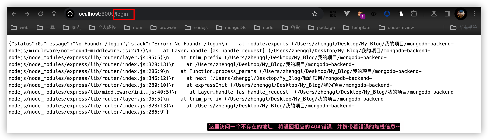

## 三方库依赖说明
> 👇 整理了关于本项目中在coding过程中所使用的三方依赖库说明清单：

| 依赖名称 | 描述 | 相关地址 |
|---|---|---|
| express | nodesj轻量级服务库 | [官方地址](https://expressjs.com/) |
| mongoose | mongodb的ogm | [官方地址](https://mongoosejs.com/) |
| bcrypt | 加密库，用于加密以及密码校验用途 | [库地址](https://www.npmjs.com/package/bcrypt) |
| jsonwebtoken | 用于token的校验和处理工作 | [库地址](https://www.npmjs.com/package/jsonwebtoken) |
| dotenv | 用于加载环境变量的三方库，便于将相关的配置信息通过文件配置化的方式来维护，且在项目中可通过`process.env.*`的方式来访问到 | [库地址](https://www.dotenv.org/) |
| body-parser | 用于对请求体的解析，使得后续的中间件可以从`res.body`中获取请求参数信息 | [库地址](https://www.npmjs.com/package/body-parser) |
|  |  |  |

## express官方的中间件以及自定义中间件
> 使用`express`来开发的话，一般会配套使用官方所提供的中间件， 👇 是对应的官方中间件说明清单：

1. `express-async-handler`: 简单的中间件，用于处理`express`路由内的异常，并将它们传递给EXPRESS错误处理程序
   🤔 用于自动将中间中产生的异常，自动`next`到下一个中间件，省去了在每一个中间件中显示地调用`next()`方法来将任务转移到下一个中间件，详见[官网对比描述](https://www.npmjs.com/package/express-async-handler#usage)
2. `morgan`: 请求日志输出中间件，用于将客户端请求的路径、方式、响应时长等信息给输出来，便于调试；
3. `multer`: 处理文件上传的中间件，获取客户端提交的文件资源，并进行远程服务器存储，然后返回远程路径给回客户端，详见[官网描述](https://github.com/expressjs/multer)；
4. `serve-static`: 在线静态资源的直接访问，通过配置的方式，对上传上来的文件资源提供在线访问的目的，[详见官网](https://github.com/expressjs/serve-static#readme)
5. `cors`: `Cross-Origin Resource Sharing`，一种安全机制，它允许Web页面跨域进行资源共享，默认情况下，来自不同源的Web页面不能够共享资源，源是由协议、域名和端口三者组合定义的，只有当所有三者都匹配时，两个URL才属于同一个源，[详见官网](https://github.com/expressjs/cors#readme);
6. `express-validator`: 数据校验中间件，用于处理客户端所传递过来的数据校验动作，基于路由中间件，通常用于校验进入应用程序的请求数据，并在数据进入控制器逻辑之前拦截无效请求。这有助于防止不合理的输入数据导致的潜在错误，减轻后端控制器的负担，[详见官网](https://express-validator.github.io/docs/);

### 本地自定义中间件
> 因实际业务开发需要，针对业务进行相应的本地化中间件开发，以便于满足项目的变动发展诉求， 👇 是对应的自定义本地中间件说明清单：

| 中间件名称 | 描述 |
|---|:---|
| not-found-middleware | 找不到服务，也就是404 |
| service-error-middleware | 统一的异常处理中间件 |
| response-wrapper-middleware | 统一的网络响应自定义格式化中间件，提供自定义的`success`以及`failed`方法来向业务提供一键调用的方法 |
|  |  |
|  |  |

### .env配置文件变量声明
1. MONGODB_URL: mongodb数据库连接地址，这里使用的是官方所提供的免费共享的数据库；
2. SERVICE_PORT: 后台服务启动绑定的端口号；

## 项目过程记录
> 此目录以及后续的内容，将记录整个项目过程中的笔记，便于后续跟踪与反查问题！！

### 根据标准的MVC理念，创建好对应的文件资源目录，如下图所示：
  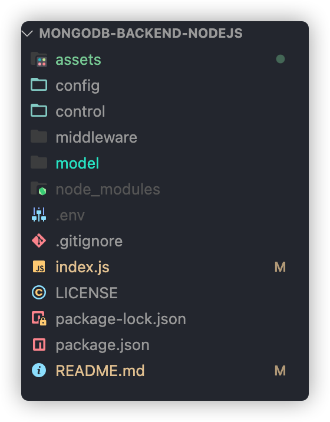

### 创建完成404以及公共的异常处理中间件(具体见两中间件的代码内容)，并做对应的测试验证：
```javascript
app.get('/login', (req, res, next) => {
  const error = new Error('自定义异常信息')
  throw error;
})
```


### 根据业务实际场景，将项目拆分为不同的模块，同时对应于不同的路由模块，同时借鉴于前端模块化开发的方式，将所有的路由模块采用对外仅暴露一个入口的方式 
```javascript
  const userRouter = require('./userRouter')
  // 这里采用对外暴露一个接收app应用程序入口的方式，来对外隐藏注册的方式
  module.exports = app => {
    app.use('/user', userRouter);
  }
```

### 在以往的项目前后端接口对接中，一般需要严格规定采用商定好的固定数据结构来交互，以免因为后续业务逻辑的迭代导致项目难以维护，因此这里采用 👇 以下这种数据结构
```json
  {
    "status": 0,
    "message": "business logic operate result",
    "data": {}
  }
```
🤔️ 关于👆几个字段的描述如下：
1. status: 代表接口处理结果，一般0代表处理正常，即将返回正常对应的结果目标数据，非0则根据实际业务场景进行枚举清单的罗列，最好是将这个枚举值清单🧾整理到项目中，以便于项目团队同事协同工作；
2. message: 代表接口处理结果说明，有时可作为接口结果说明提示信息来展示到前端界面上；
3. data: 这里是统一的结果数据，根据实际业务场景需要，不同的接口逻辑对应不同的data实体对象，这里关于data主要有 👇 4种数据类型：
   - boolean类型，代表动词类接口，一般true代表执行成功，false代表执行失败；
   - string/number类型，同boolean类似，结果是对应的string/number;
   - object类型，一般表示查询结果，比如查询返回某一用户信息对象;
   - object(list+page+total)类型，列表查询类，一般查询列表项目，list存储列表数据，page代表当前页码，total代表当下查询筛选条件的总数;

🤔而这个`express`框架中，则是通过对`res.json()`的方式，将结果返回给客户端的，假如直接针对这个方法进行重写的话，**将有可能因为重写了该方法而导致的其他社区/官方的中间件无法正常使用了！！**因此，可以考虑自定义响应方法，从而在业务场景中根据结果情况直接调用对应的方法～

### 创建数据库连接
> 借助于`mongoose`三方库，通过MONGODB_URL来连接到远程数据库中！
> 将db连接相关的统一到一外部方法`db-connection`中！
> ✨ 同时在连接成功后，打印相关的日志信息，在`mongoose.connection.on()`相关的回调方法中添加对应的日志代码！

### 资源上传中间件
> :confused: 也许有人会说，已经有这个`multer`中间件啦，直接用就可以啦！是的，的确如此，可以直接使用这个中间件来处理文件上传，并存储到对应的位置， :point_right: 但是在实际的项目过程中，我们会发现，随着时间的推移，项目中的资源会跟随着使用者的使用越来越多，需要对资源进行一个统一管理，假如前提没有很好的提供一个管理机制的话，是当项目起来后，是很难保持项目边运行，边实现改造迁移工作的。
> 因此，很有必要在前期进行一个设计，并赋予实施！
> :alien: 我们的目的，就是提供 :one: 个单文件上传以及 :one: 个多文件上传的接口API， :point_right: 借助于`multer`中间件，并结合`fs`、`临时文件存储`的机制，来实现文件资源管理器！
> 
> :point_down: 是对应的一个流程图：

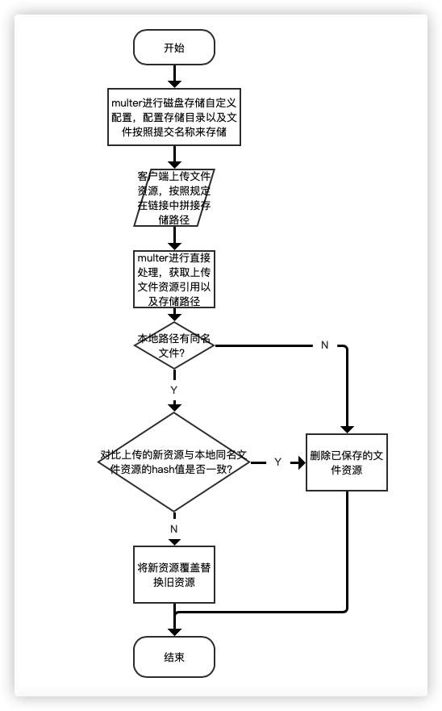

:star2: 通过直接将`multer`的上传目录当作一临时中间目录，对比本地磁盘文件与刚上传的文件的内容的hash值，从而判断是否是完全一样的文件，减少重复文件上传的可能性。
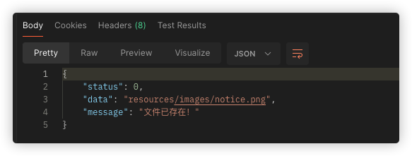
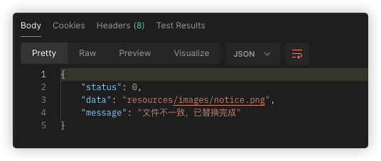

:dizzy_face: 还有其他的场景，是目前还没有提供的：
1. 比如不同的人上传的同一个文件名的文件，有可能因为没有目录控制，导致两者的文件数据可能会发生错乱；
2. 这里是先上传文件再对比的流程，实际上，还可以是在上传文件之前，在客户端采用与服务端一致的文件hash值获取逻辑，通过上传文件的hash值，与后台存储(redis、db)中所存储的hash值进行一个对比，如果存在，则直接跳过，当然，这里意味着需要对文件的hash值进行其生命周期的管理，比如上传成功后，存储/更新对应的hash值等等；
3. 实际上，文件的存储，应该是按照类型然后按照对应的日期来进行存储可能会比较好一点，这样子可能能够更好地管理磁盘文件；
4. 这边采用的在query中传递一个path字段，用于控制将在后台哪个文件夹中来存放当前上传文件，这里有一个漏洞问题，就是如果被疯狂掉用的，有可能在后台疯狂创建不同的文件夹目录，撑爆后台磁盘空间了，需要做进一步的目录上传控制！

### 开始编写业务处理中间件
> 在开始编写具体的中间件时，先引入一个请求解析中间件，否则就会出现 👇 这样子的一个结果：
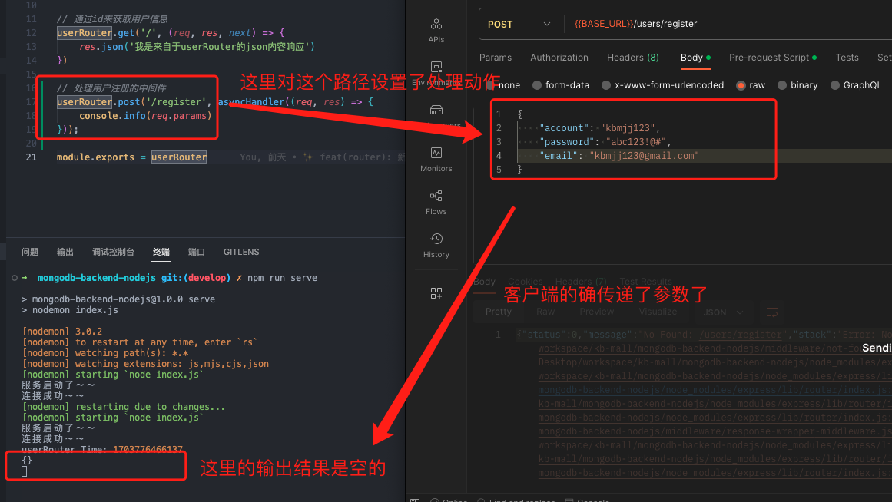

✨ 执行 👇 的命令安装对应的依赖
```shell
  npm install --save body-parser
```
✨ 将中间件集成到项目代码中
```javascript
  //? 配置解析请求体的中间件
  app.use(bodyParser.urlencoded({ extended: false }));
  app.use(bodyParser.json());
  // ....这里省略一系列代码，然后在响应处理中间件中可访问到req.body
  const newUser = await userModel.create(req.body);
```

#### 用户模块中间件
> 根据之前的设置，根据业务场景，拆分为一个个的业务中间件模块，由各自的入口文件进行一个统一的维护

##### 新增userController作为用户逻辑控制器
> 在control目录中新增`userController.js`作为业务逻辑控制器，主要引入相关的model进行db的增删查改等操作！！
> 一般情况下，我们所使用的密码都是需要密文方式来存储的，这意味着客户端必须按照同一个加密规则，来将密码传递给到后台服务，而且
> 后台服务需要针对这个密码再次进行一次加密，而且还应该提供一种方式用于对密码正确性的校验服务！
> 👉 这里，我们通过借助于`bcrypt`库，来 🈵️ 足刚刚提及到的相关目的：
```javascript
  userSchema.pre('save', async function(next){
  //? 在密码存储之前，对密码进行加盐加密
  this.password = await bcrypt.hash(this.password, Number(process.env.BCRYPT_SALT));
  next()
})
```
✨这里我们通过对`save`中间件方法进行拦截，当要保存用户信息时，自动对客户端传递的密码进行加密存储！！


🤔 既然存储成功了，那么当我们使用对应的账号与密码登录的时候，就可以通过判断账号与密码是否分别相等即可判断是否登录成功了，这里借助于`bcrypt.compare()`方法来实现对比校验的目的：
```javascript
  userSchema.methods.isPasswordMatched = async function(newPwd){
    return await bcrypt.compare(newPwd, this.password)
  }
```
✨ 这里在使用对比的同时，将这个对比方法添加在`userSchema.methods`对象上，使得所有的`model`实例拥有`isPasswordMatched`方法，用于`userModel`的密码匹配对比操作！
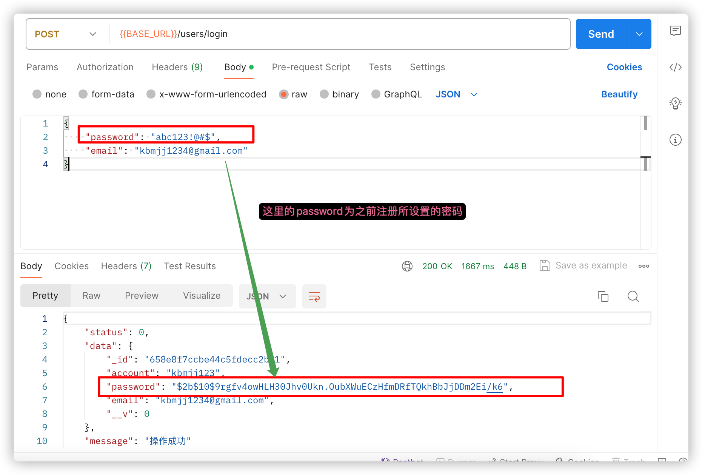

👉 这里我们当我们需要做一些从数据库中查出来的文档对象要进行相关的操作的时候，可以采用往`schema.methods`中添加实例方法的方式，这样子所有的实例则拥有公共的api方法，但是，这里的方法应该是与db查询无关的！！！
##### 新增用户授权中间件(jsonwebtoken)
> 一般的，针对不同的用户权限，可以设置其不同的访问权限，这里我们采用定义一个`auth-middle-ware`中间件，本次鉴权借助于`Bearer token(持有者令牌)`
> `Bearer token` 的工作原理是，当用户通过身份验证服务器获得访问令牌（access token）后，该令牌将被包含在每个请求的头部（通常是 Authorization 头）中。这个令牌的名称是 "Bearer"，因此它被称为 Bearer token。
> 通过在`req.headers.authorization`请求头中捞对应的token信息，并做一个简单的解析并验证其有效性：
```javascript
  let token = req?.headers?.authorization;
  console.info(token)
  token = token.split(' ')[1];
  const decode = jwt.verify(token, process.env.JWT_SECRET);
```
✨ 这里使用`jwt.verify()`方法，从`headers.authorization`中的token，使用加密前的密钥要进行有效性的验证，而这里的token则是在用户登录成功后存储于数据库中并返回，由客户端来对这个token进行管理维护，关于这个`jsonwebtoken`的相关介绍，可以查看[关于jwk的描述](https://www.91temaichang.com/2023/07/27/koa-middleware-jwt/index.html#post-info)了解相关的详情。
👉 说白了，就是将一对象使用密钥加密存储，并具备一定的有效期，然后读取的时候，拿到密文进行对比校验，检测其真伪与时间有效性，通过后，将解密出原来的数据，然后进行下一步操作！！！

👉 校验通过之后，从db中查询到对应的用户信息，通过其属性`role`判断是否拥有相应的权限(这里提前在`userSchema`中将`role`属性给创建出来，且配置仅接受枚举类型的)，这里一开始是将相关鉴权代码维护在各个业务处理中的，但考虑到后续其他场景也需要使用到这个鉴权机制，因此，这边统一将鉴权的动作挪到这个`auth-middle-ware.js`中间件中，只有验证通过了，才能够继续往下执行！！！
```javascript
  // 这里省略相关中间件代码
  if(findUser.account){
    // 将已经验证通过的账号信息追加到req.user中，并传递给下一个中间件
    req.user = findUser
    // 直接在中间件这里做一个拦截
    if('user' === findUser.role){
      res.failed(403, '', '当前用户无权限')
    }else{
      next();
    }
  }else{
    res.failed(-1, null, '登录超时！')
  }
```

##### 新增刷新token的接口API机制，并采用accessToken+refreshToken并行的机制来保证系统中token的有效性
> 当拥有了这个token的时候，由于`jsonwebtoken`的机制，我们所生成的token有一定的时效性，在实际的项目开发中，应该要确保生成的token只要继续使用的话，每次使用都将
> 自动延长token的时效性，但是`jsonwebtoken`是通过每次都生成新的token来确保延长时长的，然后客户端的token一般是保存在本地的，那么，🤔就需要一种机制，来实现自动“更新”
> 客户端token的机制，👉这里的“更新”，其实是采用了双token的方式，一个是`accessToken`(有效时长较短，用于鉴权目的)，另外一个是`refreshToken`(有效时长较长，用于刷新token的目的)，完整的双token更新机制如下所示：
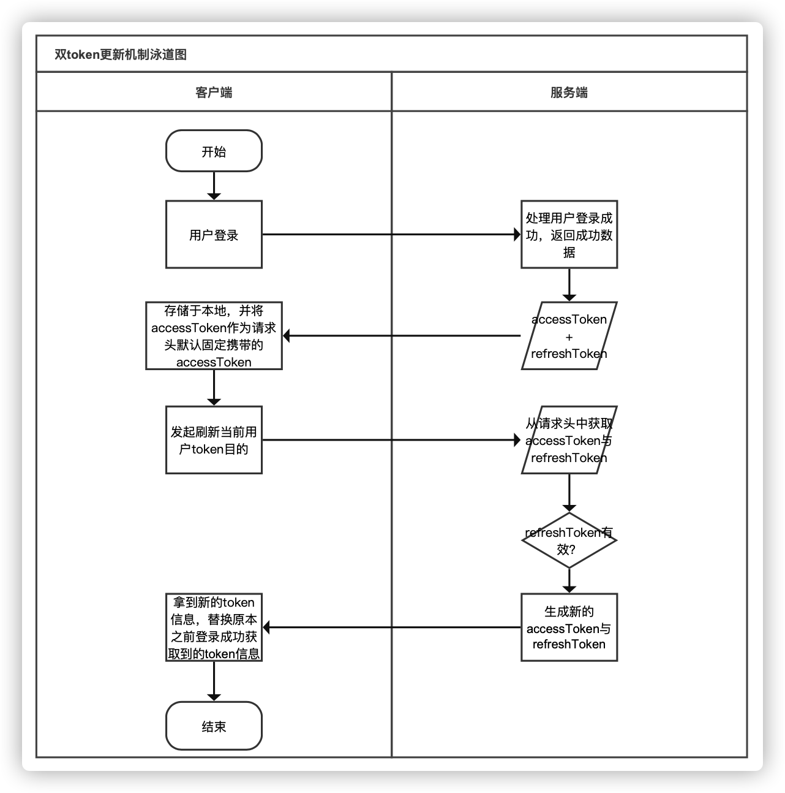

✨ 同时客户端也要配合一个流程，就是关于**accessToken在接近失效的时候，需要自动发送refreshToken动作，完成客户端token的持续有效性**！！

#### 产品模块中间件

#### 订单模块中间件

### unique属性能否用来做校验？
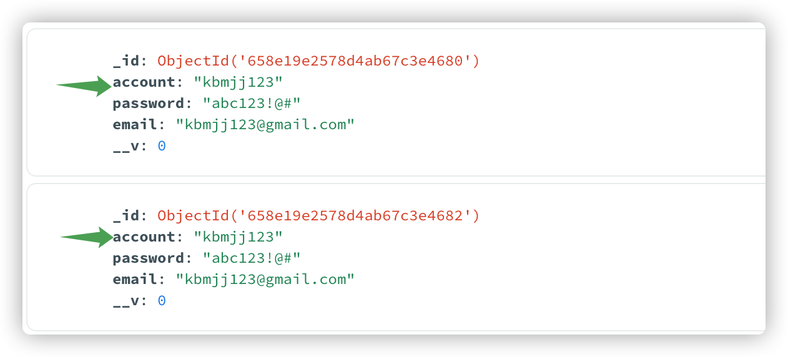
> 在定义userSchema的时候，发现属性可以配置`unique=true`，那么这种方式是否可以用来配置不能往db中插入同样value的记录？
> 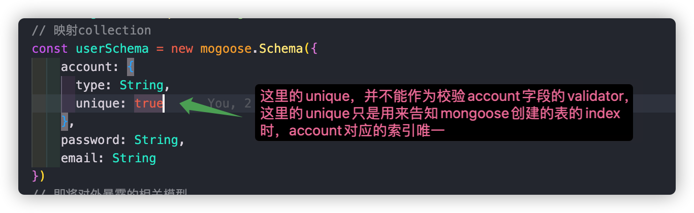
> 答案是否定的，因此这个`unique`只是用来告知创建的索引值是否要唯一，仅此而已，详见[官网描述](https://mongoosejs.com/docs/validation.html#the-unique-option-is-not-a-validator)

### 集成请求日志输出中间件

✨ 在调试的时候，我们可以通过`morgan`中间件，来查看当前请求的接口都有哪些，以及请求这些接口的基本信息。

### mongoose自动追加的默认属性
> 当我们使用`mongoose`的`new model().save()`方法来创建一条记录的时候，在`model`所捆绑的`schema`中的属性，将会自动创建出来，并赋予默认的属性值，方便后续的插入校验验证问题！！

### 关于请求参数的校验
> 在进行商品的发布/编辑接口逻辑编写的时候，发现如果手动一个个来编写这个参数的校验的话，将会导致接口方法逻辑比较长，而且好像也没办法复用，因此，这边在使用原本`mongoose`
> 所提供的校验服务的基础上，另外新增了`express-validator`这个基于路由层面的数据校验中间件，通过对请求中的`body`、`query`、`header`等不同位置的数据进行获取与校验，
> 在进入到`model`层之前进行数据的校验，减少数据库的自我校验压力。
```javascript
  const express = require('express');
  const app = new express();
  // 在还未使用校验中间件之前的处理方式
  app.get('/hello', (req, res) => {
    let { field1 } = req.body;
    if(field1){
      throw new Error('必须传递数值类型的field1')
    }
    res.send(`Hello, ${req.body.person}!`);
  })
  // 在使用了`express-validate`之后
  const { body, validationResult } = require('express-validator');
  app.get('/hello', body('field1').notEmpty(), (req, res) => {
    const result = validationResult(req);
    if (result.isEmpty()) {
      return res.send(`Hello, ${req.body.person}!`);
    }
    res.send({ errors: result.array() });
  })
```
:stars: 当需要校验的属性并没有那么多且复杂的时候，单纯的直接将其逻辑维护到方法中并没有什么，但是一旦需要校验的字段属性较多，而且校验规则较为复杂的时候，就需要庞大的校验规则，而且也无法复用已经维护好的校验规则，因此，针对这种场景，采用**express-validator**来对数据进行中间件层面的校验，通过在中间件层面，对客户端请求进行数据拦截处理，并在校验通过后，进入到下一个中间件，提前将错误进行拦截，减少数据库代码逻辑的执行压力！！

:trollface: 实际上在使用的时候，为了更好的维护项目代码，这边采用将校验与逻辑完全的分开，校验中间件单独处理校验动作以及校验结果判断，而逻辑中间件则保留原本的逻辑代码不变化，如下代码所示：

```javascript
  // ...这里省略一系列相关的代码
  // 发布一个商品，路由路径以及请求方式保留原本的定义不变
  productRouter.put('/publish', productCtrl.createProduct);
  // 同样正常引入express-async-handler
  const asyncHandler = require('express-async-handler');
  const { body, validationResult } = require('express-validator');
  const validateProduct = [
    body('productName').notEmpty().trim().isLength({ max: 60 }),
    body('cates').notEmpty().isArray(),
    // 这里根据实际情况进行各个字段的一系列判断
    // 这里是结果校验判断中间件，这里可根据实际情况判断是否需要使用异步操作
    asyncHandler(async (req, res, next) => {
      const errorResult = validationResult(req);
      if(!errorResult){
        // 如果校验通过，则进入到下一个中间件
        next()
      }
      // 校验失败，则提示失败原因，这里走统一的自定义格式输出动作
      res.failed(-1, { errors: result.array() })
    })
  ]
  export createProduct = [validateProduct, asyncHandler(async (req, res) => {
    // 这里依旧是正常的逻辑处理动作
  })]
```
:star: 通过上述的方式，将校验动作与原本的逻辑完全的分离开来，最终对外提供一数组方式的中间件成员即可！！

:confused: 如果我这个校验动作是异步的话，比如需要从db中查询是否为正确的字段时，需要使用到其自定义校验，如下代码所示：
```javascript
  const validateProduct = [
    body('cates').custom(async value => {
      // 这里的value字段为实际的字段值
      const findCates = await productModel.findOne()
      if(!findCates){
        throw new Error('请填写正确的分类id')
      }
    })
  ]
```
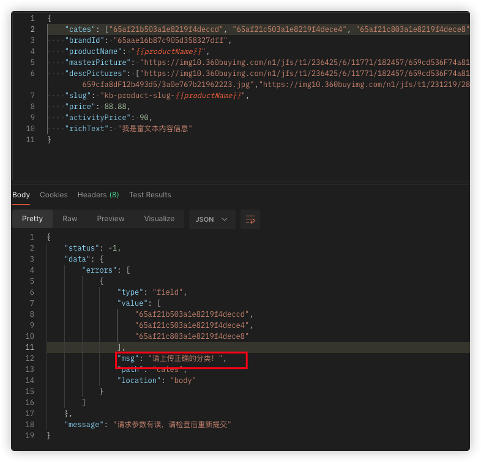

:point_right: 如果校验动作都是一致的话，还可以直接将内置的校验结果判断中间件给抽离出来，单独进行统一的维护！！

:confused: 上述的输出结果中，都是英文的输出，是否可以实现针对字段级别进行自定义message的配置输出呢？
```javascript
  //... 这里隐藏一系列代码
  body('productName', '请维护商品名称')
```


### 自定义mongoose全局插件
> 在实际的项目过程中，我们不能够完全相信客户端提交过来的数据，比如有些字段可能没有去除字段两端的空格，那么这个时候，可以使用`mongoose`的注册全局插件的方式，对项目中的所有的`schema`中的字符串字段在保存的时候，
> 提供一个自我转换的功能，来实现这个目的，如下所示： 
```javascript
  // 在数据库连接之前，进行全局插件的注册
  const globalPlugin = (schema, options) => {
    // 这里的options则代表插件的参数，可实现参数化掉用的目的
    // schema为mongoose中的所有的schema对象，通过对这个schema中的属性进行遍历处理
    schema.pre('save', function(next) {
      Object.keys(schema.paths).forEach(field => {
        if(this[field]){
          // 所有插入到db中的字段，都必须进行trim操作，避免存储了左右为空的字符串
          if(schema.pathType(field) === 'String'){
            // 如果文档中的field属性存在且为字符串类型的
            this[field] = this[field].trim();// 统一去除字符串两端的空白字符串
          }
        }
        next();
      })
    })
  }
  // 在connect到数据库之前
  mongoose.plugin(globalPlugin);
```

## 项目过程中的坑
> 本章节主要在实际的项目编码过程中，所遇到的坑，以免后续再踩！！！

### 连接mongodb官网提供的免费数据库，一直连接不上，开了代理也是如此
> 可通过阅读官方的[网络连接](https://www.mongodb.com/docs/atlas/troubleshoot-connection/)，通过设置google的公共DNS，实现远程正常访问数据库的目的！
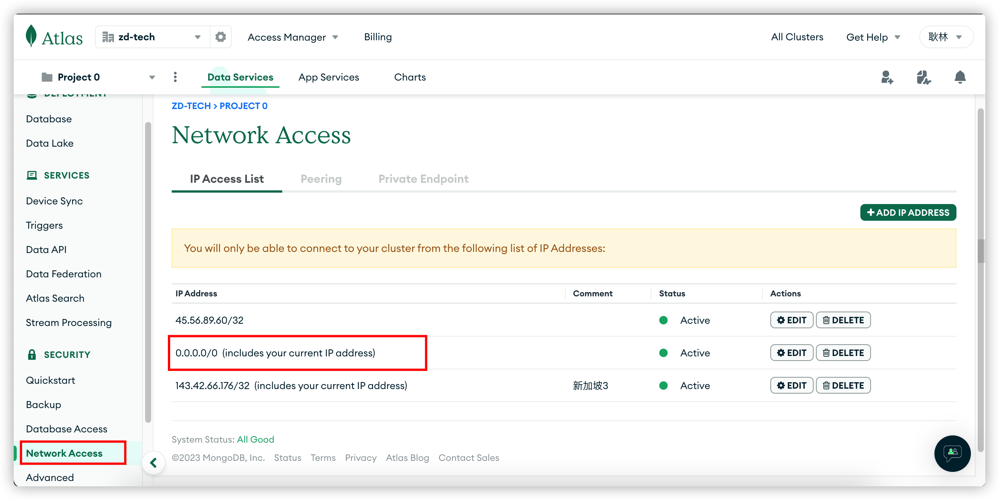
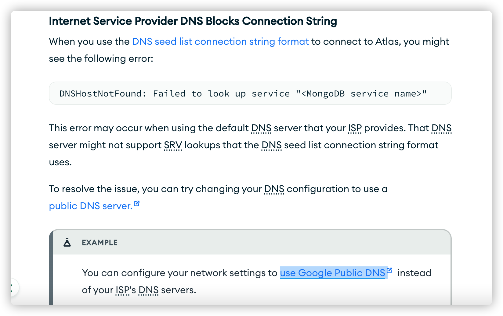

### 关于使用mongodb与mongoose，需要将要连接的数据库也维护到url中
> 😡 在拿`mongodb`以及`mongoose`两个官方文档对比编码的时候，忘记将数据库也维护到`driver`的链接中，导致数据成功插入了，但是数据在数据库中却没有查询到！！！
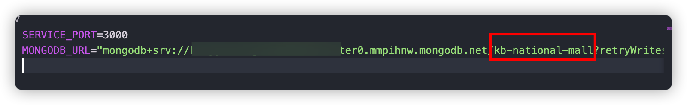

### 关于mongoose中的findOne()加不加exec()方法
> `mongoose`中的`query.exec()`通常用于执行一个操作并返回一个Promise对象，如果没有添加这个`exec()`方法(比如使用Model.findOne()方法)，那么这个时候，
> `Model.findOne()`方法将返回一个隐藏的Promise，这个时候，我们可以通过对结果直接通过属性访问符即可直接访问到目标结果
```javascript
  // 方式一：
  const findUser = await userModel.findOne({_id: 'xxx_id'}).exec()
  // 方式二：
  const findUser = await userModel.findOne({_id: 'xxx_id'})
  // 以上两种方式，都可以采用 👇 的方式来读取信息
  console.info(findUser.account)
```

### 关于mongoose的Model.updateOne()方法不起作用的原因
> 在项目coding的过程中，发现`Model.updateOne()`始终返回的是`{acknowledged: false}`，检查了其他的连接相关的代码，都正常，最后发现，这个 **mongoose不允许schema修改schema之外的字段(mongoose默认为严格模式)**，也就是说，虽然`mongodb`并没有严格限制说追加字段必须像`mysql`那样子来维护，但是，我们在使用`mongoose`的时候，则必须提前将相关涉及到的字段给维护起来，以免在更新的时候，直接执行异常！！！

### 关于jwt异常使用的方式
> `jwt.verify()`方法在执行的时候，如果这个时候因为过期原因导致的异常，将直接通过`throw error`的方式来将异常抛出，因此，我们在使用这个方法进行token有效性校验的时候，就需要使用`try...catch`的方式，来将可能的异常进行自行捕获，并在异常发生的时候，将异常给丢出来！

### 关于mongoose中ObjectId数组类型的定义
> 在使用`mongoose`来定义`schema`中的属性类型的时候，假如需要将某个属性定义为`*ObjectId数组外键*`的话，则可以按照 :point_down: 的方式来声明：
```js
// 单纯的定义为ObjectId数组
  const schema = new mongoose.Schema({
    products: {
      type: [mongoose.SchemaTypes.ObjectId]
    }
  })
// 定义为对象，并将其设置为后续可通过populate关联查询为对应的商品对象
  const schema = new mongoose.Schema({
    products: {
      type: [{
        type: mongoose.SchemaTypes.ObjectId,
        ref: 'products'
      }]
    }
  })
```

### 关于mongoose中嵌套查询的使用
> 在使用`mongoose`来对数据进行查询时候，假如需要将一个列表转为树状，比如这个分类列表树状结构输出，需要应用层自定义逻辑代码，
> 通过过滤筛选动作，查询出对应的数据，但是由于在查询的过程中又进行了嵌套查询操作，这边采用了`Array.map()`方法对查询结果进行
> 转换输出，针对每个元素又再次进行的查询筛选动作，:point_right: 因此，需要将每一次的查询筛选动作转换为一个promise，
> 然后借由`Promise.all()`方法，来将所有的查询结果给then出来
```javascript
  const childCateListPromise = cateList2.map(async (cate2) => {
    const cateList3 = await cateModel.find({parentId: cate2._id});
    return {
      ...cate2.toObject(),
      children: cateList3
    }
  });
  const children = await Promise.all(childCateListPromise);
```
:stars: 这里通过将cateList2转换为promise数组，然后最后再一口气执行全部的promise，实现将结果输出至children属性中！！！

### 关于model.findByIdAndUpdate()方法没有触发属性的校验规则
> 当我们通过`mongoose`的`model.findByIdAndUpdate()`方法来更新一个属性的时候，如果没有在其第三个参数中声明`runValidators:true`的时候，
> 虽然我们已经给属性定义的时候，将其`validate`也进行了相应的配置，但是在某些情况下，`mongoose`在更新时，可能允许绕过验证，这是因为`mongoose`默认情况下只会验证传递给
> `save()`方法的数据，为了确保属性的自我校验规则能够被自动的触发，因此需要往相应的方法(model.findByIdAndUpdate)中传递`runValidators: true`的属性，告知该API
> 当执行相关的操作的时候，自动进行对应的校验操作！！

## 项目由js升级至ts
[升级文档](./doc/升级至ts.md)

## 项目调试
> 作为后端API服务开发，一般都需要进行接口API的调试与验证，因此，这边采用`postman`来进行调试，通过配置其中的公共逻辑部分以及对应的参数获取逻辑，使得整个项目能够共用同一个接口调试逻辑！
> 👉 这个是我的team：https://www.postman.com/zglin8902/workspace/kbmjj123

