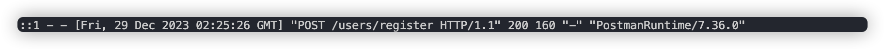

# mongodb-backend-nodejs

## 前言
> 作为学习mongodb后台服务编程的demo项目，从0到1搭建相应的代码目录框架。
> 并以此来提升关于`nodejs`学习的熟悉程度

## 目录结构说明
```
mongodb-backend-nodejs
├─ LICENSE
├─ README.md
├─ assets
│  ├─ watch模式启动服务.png
│  ├─ 目录结构.png
│  └─ 访问不存在的链接异常结果.png
├─ config
├─ control
├─ index.js
├─ middleware
│  ├─ not-found-middleware.js
│  ├─ response-wrapper-middleware.js
│  └─ service-error-middleware.js
├─ model
│  └─ userModel.js
└─ package.json
```

## 启动命令
> 一般地，我们采用`node index.js`的方式来启动一个程序，😣 但是，在实际的编码过程中，我们会经常更改相关的程序文件，每次都需要关掉旧服务，并重新开启新的服务，因此，可以借助于新的一个库：`nodemon`，关于这个库的说明，详情见 [官网](https://www.npmjs.com/package/nodemon)，通过使用这个`nodeman`命令，可以实现免重启服务实现代码的更新！
```shell
  nodeman index.js
```
这边同时将执行服务的命令，维护到`package.json`中的`script`节点中，并执行详情的命令，效果如下：


## 三方库依赖说明
> 👇 整理了关于本项目中在coding过程中所使用的三方依赖库说明清单：

| 依赖名称 | 描述 | 相关地址 |
|---|---|---|
| express | nodesj轻量级服务库 | [官方地址](https://expressjs.com/) |
| mongoose | mongodb的ogm | [官方地址](https://mongoosejs.com/) |
| bcrypt | 加密库，用于加密以及密码校验用途 | [库地址](https://www.npmjs.com/package/bcrypt) |
| jsonwebtoken | 用于token的校验和处理工作 | [库地址](https://www.npmjs.com/package/jsonwebtoken) |
| dotenv | 用于加载环境变量的三方库，便于将相关的配置信息通过文件配置化的方式来维护，且在项目中可通过`process.env.*`的方式来访问到 | [库地址](https://www.dotenv.org/) |
| body-parser | 用于对请求体的解析，使得后续的中间件可以从`res.body`中获取请求参数信息 | [库地址](https://www.npmjs.com/package/body-parser) |
|  |  |  |

## express官方的中间件以及自定义中间件
> 使用`express`来开发的话，一般会配套使用官方所提供的中间件， 👇 是对应的官方中间件说明清单：

1. `express-async-handler`: 简单的中间件，用于处理`express`路由内的异常，并将它们传递给EXPRESS错误处理程序
   🤔 用于自动将中间中产生的异常，自动`next`到下一个中间件，省去了在每一个中间件中显示地调用`next()`方法来将任务转移到下一个中间件，详见[官网对比描述](https://www.npmjs.com/package/express-async-handler#usage)
2. `morgan`: 请求日志输出中间件，用于将客户端请求的路径、方式、响应时长等信息给输出来，便于调试；


### 本地自定义中间件
> 因实际业务开发需要，针对业务进行相应的本地化中间件开发，以便于满足项目的变动发展诉求， 👇 是对应的自定义本地中间件说明清单：

| 中间件名称 | 描述 |
|---|:---|
| not-found-middleware | 找不到服务，也就是404 |
| service-error-middleware | 统一的异常处理中间件 |
| response-wrapper-middleware | 统一的网络响应自定义格式化中间件，提供自定义的`success`以及`failed`方法来向业务提供一键调用的方法 |
|  |  |
|  |  |

### .env配置文件变量声明
1. MONGODB_URL: mongodb数据库连接地址，这里使用的是官方所提供的免费共享的数据库；
2. SERVICE_PORT: 后台服务启动绑定的端口号；

## 项目过程记录
> 此目录以及后续的内容，将记录整个项目过程中的笔记，便于后续跟踪与反查问题！！

### 根据标准的MVC理念，创建好对应的文件资源目录，如下图所示：
  

### 创建完成404以及公共的异常处理中间件(具体见两中间件的代码内容)，并做对应的测试验证：
```javascript
app.get('/login', (req, res, next) => {
  const error = new Error('自定义异常信息')
  throw error;
})
```


### 根据业务实际场景，将项目拆分为不同的模块，同时对应于不同的路由模块，同时借鉴于前端模块化开发的方式，将所有的路由模块采用对外仅暴露一个入口的方式 
```javascript
  const userRouter = require('./userRouter')
  // 这里采用对外暴露一个接收app应用程序入口的方式，来对外隐藏注册的方式
  module.exports = app => {
    app.use('/user', userRouter);
  }
```

### 在以往的项目前后端接口对接中，一般需要严格规定采用商定好的固定数据结构来交互，以免因为后续业务逻辑的迭代导致项目难以维护，因此这里采用 👇 以下这种数据结构
```json
  {
    "status": 0,
    "message": "business logic operate result",
    "data": {}
  }
```
🤔️ 关于👆几个字段的描述如下：
1. status: 代表接口处理结果，一般0代表处理正常，即将返回正常对应的结果目标数据，非0则根据实际业务场景进行枚举清单的罗列，最好是将这个枚举值清单🧾整理到项目中，以便于项目团队同事协同工作；
2. message: 代表接口处理结果说明，有时可作为接口结果说明提示信息来展示到前端界面上；
3. data: 这里是统一的结果数据，根据实际业务场景需要，不同的接口逻辑对应不同的data实体对象，这里关于data主要有 👇 4种数据类型：
   - boolean类型，代表动词类接口，一般true代表执行成功，false代表执行失败；
   - string/number类型，同boolean类似，结果是对应的string/number;
   - object类型，一般表示查询结果，比如查询返回某一用户信息对象;
   - object(list+page+total)类型，列表查询类，一般查询列表项目，list存储列表数据，page代表当前页码，total代表当下查询筛选条件的总数;

🤔而这个`express`框架中，则是通过对`res.json()`的方式，将结果返回给客户端的，假如直接针对这个方法进行重写的话，**将有可能因为重写了该方法而导致的其他社区/官方的中间件无法正常使用了！！**因此，可以考虑自定义响应方法，从而在业务场景中根据结果情况直接调用对应的方法～

### 创建数据库连接
> 借助于`mongoose`三方库，通过MONGODB_URL来连接到远程数据库中！
> 将db连接相关的统一到一外部方法`db-connection`中！
> ✨ 同时在连接成功后，打印相关的日志信息，在`mongoose.connection.on()`相关的回调方法中添加对应的日志代码！

### 开始编写业务处理中间件
> 在开始编写具体的中间件时，先引入一个请求解析中间件，否则就会出现 👇 这样子的一个结果：


✨ 执行 👇 的命令安装对应的依赖
```shell
  npm install --save body-parser
```
✨ 将中间件集成到项目代码中
```javascript
  //? 配置解析请求体的中间件
  app.use(bodyParser.urlencoded({ extended: false }));
  app.use(bodyParser.json());
  // ....这里省略一系列代码，然后在响应处理中间件中可访问到req.body
  const newUser = await userModel.create(req.body);
```

#### 用户模块中间件
> 根据之前的设置，根据业务场景，拆分为一个个的业务中间件模块，由各自的入口文件进行一个统一的维护

##### 新增userController作为用户逻辑控制器
> 在control目录中新增`userController.js`作为业务逻辑控制器，主要引入相关的model进行db的增删查改等操作！！
> 一般情况下，我们所使用的密码都是需要密文方式来存储的，这意味着客户端必须按照同一个加密规则，来将密码传递给到后台服务，而且
> 后台服务需要针对这个密码再次进行一次加密，而且还应该提供一种方式用于对密码正确性的校验服务！
> 👉 这里，我们通过借助于`bcrypt`库，来 🈵️ 足刚刚提及到的相关目的：
```javascript
  userSchema.pre('save', async function(next){
  //? 在密码存储之前，对密码进行加盐加密
  this.password = await bcrypt.hash(this.password, Number(process.env.BCRYPT_SALT));
  next()
})
```
✨这里我们通过对`save`中间件方法进行拦截，当要保存用户信息时，自动对客户端传递的密码进行加密存储！！

🤔 既然存储成功了，那么当我们使用对应的账号与密码登录的时候，就可以通过判断账号与密码是否分别相等即可判断是否登录成功了，这里借助于`bcrypt.compare()`方法来实现对比校验的目的：
```javascript
  userSchema.methods.isPasswordMatched = async function(newPwd){
    return await bcrypt.compare(newPwd, this.password)
  }
```
✨ 这里在使用对比的同时，将这个对比方法添加在`userSchema.methods`对象上，使得所有的`model`实例拥有`isPasswordMatched`方法，用于`userModel`的密码匹配对比操作！

👉 这里我们当我们需要做一些从数据库中查出来的文档对象要进行相关的操作的时候，可以采用往`schema.methods`中添加实例方法的方式，这样子所有的实例则拥有公共的api方法，但是，这里的方法应该是与db查询无关的！！！

#### 产品模块中间件

#### 订单模块中间件

### unique属性能否用来做校验？

> 在定义userSchema的时候，发现属性可以配置`unique=true`，那么这种方式是否可以用来配置不能往db中插入同样value的记录？
> 
> 答案是否定的，因此这个`unique`只是用来告知创建的索引值是否要唯一，仅此而已，详见[官网描述](https://mongoosejs.com/docs/validation.html#the-unique-option-is-not-a-validator)

### 集成请求日志输出中间件

✨ 在调试的时候，我们可以通过`morgan`中间件，来查看当前请求的接口都有哪些，以及请求这些接口的基本信息。

## 项目过程中的坑
> 本章节主要在实际的项目编码过程中，所遇到的坑，以免后续再踩！！！

### 连接mongodb官网提供的免费数据库，一直连接不上，开了代理也是如此
> 可通过阅读官方的[网络连接](https://www.mongodb.com/docs/atlas/troubleshoot-connection/)，通过设置google的公共DNS，实现远程正常访问数据库的目的！


### 关于使用mongodb与mongoose，需要将要连接的数据库也维护到url中
> 😡 在拿`mongodb`以及`mongoose`两个官方文档对比编码的时候，忘记将数据库也维护到`driver`的链接中，导致数据成功插入了，但是数据在数据库中却没有查询到！！！
