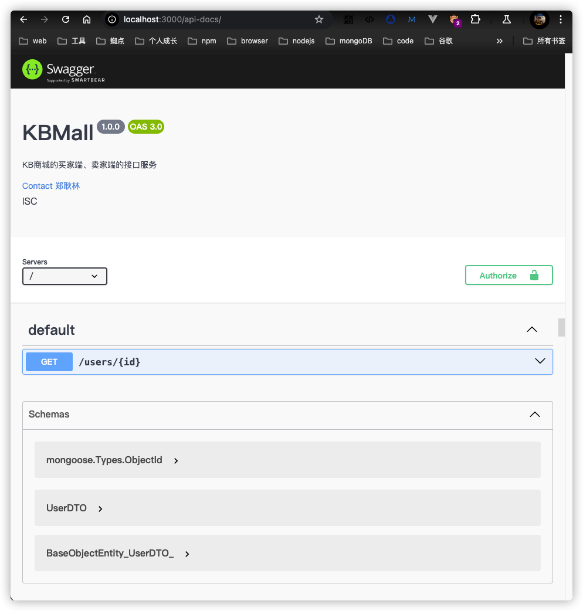
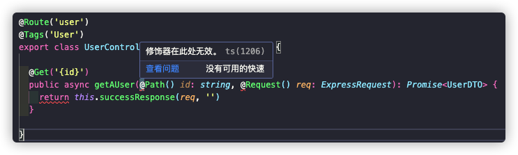

## 项目背景
---
> 目前项目的基本框架已经满足日常的开发，但是，目前遇到一个更加棘手的问题，就是如何维护项目的swagger接口文档，目前可以有两种方式：
1. 手写`swagger.json`或者`swagger.yaml`，在这个文档中一个个去维护每个接口协议；
2. 借助于`swagger-ui`以及`swagger-doc`，自动根据编写的注释来生成接口文档

:face_exhaling: 但是，上述的两种方式，基本上都是手写协议，跟代码无法建立联系(意思是代码与这个协议之间没有必然的联系，一旦修改了代码，还要手动地去修改协议)，这无疑会增加协议的维护成本。

:thinking: 那么是否可以拥有那么一种方式，可以从我们的代码中自动生成接口协议文档，当我们修改了接口协议代码时，相应地更新为最新的接口文档这样子！

### tsoa
> 目前的项目采用的是`typescript` + `express` + `mongoose`的简单架构方式，不能够满足于上述的要求！
> 因此，这边引入了新的库[tsoa](https://tsoa-community.github.io/docs/)
> 关于这个`tsoa`的官方介绍描述如下：
> `tsoa` 是一个集成了 `OpenAPI` 编译器的框架，可使用 `TypeScript` 构建 `Node.js` 服务端应用程序。它可以在运行时定位 express、hapi、koa 和更多框架。tsoa 应用程序默认是类型安全的，并且可以无缝处理运行时验证。

#### 在现有项目中集成`tsoa`库
##### 1. 安装`tsoa`库
```shell
	pnpm i tsoa 
```
##### 2. 创建`tsoa.json`配置文件
```json
{
	"entryFile": "index.ts",
	"noImlicitAdditionalProperties": "throw-on-extras",
	"controllerPathGlobs": ["/**/*Controller.ts"],
	"spec": {
		"outputDirectory": "build",
		"specVersion": 3
	},
	"routes": {
		"routesDir": "build"
	}
}
```
:thinking: 这里我们指定`index.ts`作为应用程序的入口文件，所引用的`Controller`为`controller`目录中的`*Controller.ts`文件，然后生成的`swagger.json`配置文件，将使用的版本是3系列的openAPI，目录为`build`目录，接着定义即将生成的路由配置文件`routes`将位于`build`目录中！
:point_right: 关于这个`tsoa.json`配置文件中的其他参数描述，具体见[官方tsoa配置说明](https://tsoa-community.github.io/reference/interfaces/_tsoa_cli.Config.html)

##### 3. 维护`tsoa`的相关脚本到项目中
在项目中中`package.json`中维护相关的`tsoa`脚本命令
```json
{
	"script": {
		"build-openapi": "tsoa spec",
    "build-routes": "tsoa routes --verbose",
    "build-doc": "tsoa spec-and-routes",
		"serve": "pnpm build-doc && nodemon --exec ts-node -r tsconfig-paths/register index.ts"
	}
}
```
上述我们创建了3个脚本，`tsoa spec` 用来根据当前配置的`*Controller.ts`中维护的配置来生成`swagger.json`文件，`tsoa routes --verbose`则用来根据这个`*Controller.ts`来生成对应的`routes.ts`项目中的路由，这个`tsoa spec-and-routes`则用来同时生成这两个文件！

##### 4. 浏览路由配置文件，安装`@tsoa/runtime`依赖
```typescript
import { TsoaRoute, fetchMiddlewares, ExpressTemplateService } from '@tsoa/runtime';
export function RegisterRoutes(app: Router) {
	// ... 路由的注册相关代码逻辑
}
```
:point_right: 由于生成的路由配置文件依赖于`@tsoa/runtime`，因此，需要安装对应的依赖到项目中！

##### 5. 在应用的入口文件`index.ts`中导入`RegisterRoutes`，配置路由对应的中间件
```typescript
import express from 'express'
import { RegisterRoutes } from './build/routes';
RegisterRoutes(app)
const app = express();
```
通过上述的代码，将`*Controller.ts`中定义的动作与路由给捆绑到一起，使得我们编写的Controller的方法能够响应对应的路由

##### 6. 根据生成的`swagger.json`来生成服务的openAPI文档
```typescript
// swagger-doc-middleware.ts
import swaggerUI from 'swagger-ui-express'
import { Express, Request, Response } from 'express'

export function setupSwagger(app: Express){
	app.use('/api-docs', swaggerUI.serve, async (req: Request, res: Response) => {
		return res.send(swaggerUI.generateHTML(await import('../build/swagger.json')))
	})
}
// index.ts
import express from 'express'
const app = express();
setupSwagger(app);
```
将`tsoa spec`生成的`/build/swagger.json`配置文件采用`swagger-ui-express`进行加载并渲染对应的内容(也就是使用swaggerUI来生成静态站点资源)，并挂载到路径`api-docs`上，于是，我们可以通过访问`http://localhost:3000/api-docs`来访问到对应的接口站点文档信息，如下图所示：


##### 7. 补充说明关于`*Controller.ts`中的接口定义与对应的schema声明


### 实践过程中的踩坑
> 本章节将记录在集成`tsoa`库的过程的坑，防止后续犯同样的错误！

#### 1. ts版本要求以及注解支持
> 根据`tsoa`的官方文档所描述的，由于是采用注解的方式的来编写的`Controller`，因此，需要保证这个ts版本是在5.0以上，而且，需要在这个`tsconfig.json`配置中加入以下的配置：
```json
{
	"experimentalDecorators": true,
  "emitDecoratorMetadata": true
}
```
否则将会出现以下的错误：


#### 2. 追加对json文件的导入支持
> `typescript`原本不支持对`*.json`文件的支持的，需要在对应的`tsconfig.json`配置文件中加入以下的配置：
```json
{
	"resolveJsonModule": true
}
```

#### 3. 由于项目原本在`tsconfig.json`加入了别名配置，需要将其同步至`tsoa.json`中
```json
{
	"compilerOptions": {
    "baseUrl": ".",
    "paths": {
      "@/*": ["./*"],
      "@/enum": ["./enum"],
      "@/entity": ["./entity"],
      "@/config": ["./config"],
      "@/control": ["./control"],
      "@/middleware": ["./middleware"],
      "@/model": ["./model"],
      "@/utils": ["./utils"]
    }
  }
}
```
只有将对应的别名同步到`tsoa.json`中，才能够使得`@/*`得以正常导入引用！否则将会爆找不到对应的依赖模块！

#### 4. 由于项目的别名机制，需要将`tsoa`也加入到别名的名单中
由于项目采用这个启动命令来加载(主要是为了能够让ts能够加载到别名文件)，具体见[官方描述](https://github.com/dividab/tsconfig-paths)
`nodemon --exec ts-node -r tsconfig-paths/register index.ts`
:point_right: 因此，需要在`tsconfig.json`中加入这个`tsoa`，使得程序能够识别到(否则就会报`tsoa TypeError: Class extends value undefined is not a constructor or null`)：
```json
{
	"compilerOptions": {
    "baseUrl": "./",
    "paths": {
      //... 此处隐藏其他的配置
      "tsoa": ["node_modules/tsoa"]
    },
	}
}
```

#### 5. `tsoa`中的所需要的model类型必须是静态类型的，而非动态类型的
原本想着当前的项目采用的是`express` + `mongoose` + `tsoa`的，可以通过`mongoose.InferSchemaType`从`mongoose.schema`中获取到对应的类型，然后将这个类型直接丢给`Controller`来生成目标`schema`，可以节省一次同样代码的编写过程，结果被自己的小聪明给整了，因为这样子做的话，将提示：
`tsoa No matching model found for referenced type userSchema.`，这个问题与[网上别人提供的issue类似](https://github.com/lukeautry/tsoa/issues/1256)

:point_right: 最后只能是手写这个静态类型的DTO，这里我们编写是一个class，采用从`mogoose.schema`中导出来的`interface`来进行实现，免去了一个个属性的编写过程
```typescript
export class UserDTO implements IUser{
	// 然后自动fix相关的属性，然后在将这个IUser给删掉
}
```
```typescript
export class UserDTO {
	password!: string;
	/**
	 * 用户邮箱
	 * @example "kbmjj123@gmail.com"
	*/
	email!: string;
	/**
	 * 用户角色
	*/
	role!: "user" | "admin";
	refreshToken?: string | null | undefined;
	accessToken?: string | null | undefined;
	nickName?: string | null | undefined;
	avatar?: string | null | undefined;
	address?: Types.ObjectId | null | undefined;
	loginTime?: Date | null | undefined;
	logoutTime?: Date | null | undefined;
	account?: string | null | undefined;
}
```