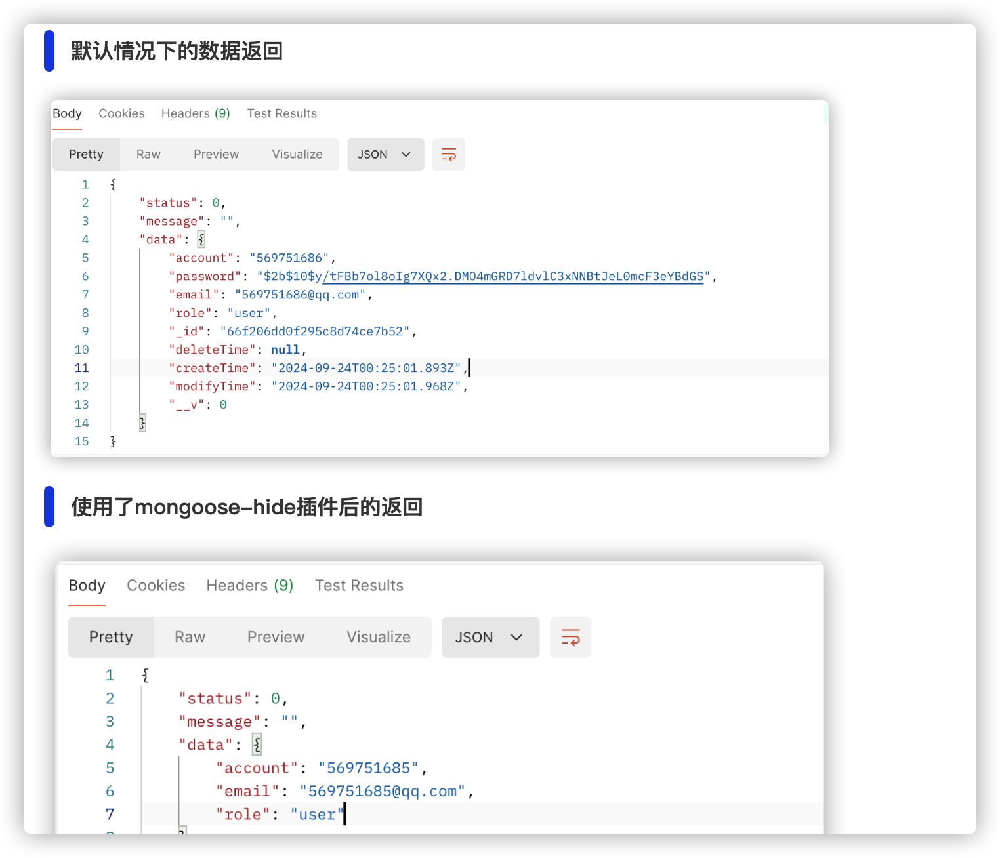
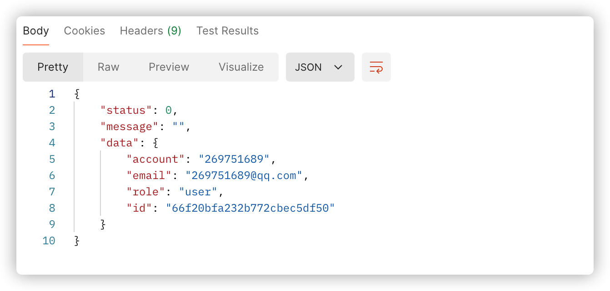

## 字段返回控制
---

### 前言
> 在实际的项目过程中，需要对客户端进行一些响应字段的隐藏，比如像是`_id`、`password`、`createTime`、`deleteTime`等等， :thinking: 一般情况下，可以通过对`schema`定义的属性进行追加`select=false`，这个在[软删除机制](./软删除机制.md)中也有提及到
> :warning: 但是，如果我们通过`Model.create()`或者是`Model.save()`来返回这个操作结果记录的话，则还是会返回了原本计划要隐藏的字段属性，那么针对这种情况，应该如何做呢？

### 引入`mongoose-hidden`插件
> 针对上述的情况，引入这个`mongoose-hidden`插件，可以很方便的进行全局以及局部的字段控制。
官网关于这个插件的描述定义是：`Mongoose 模式插件可挂接到 toJSON() 和 toObject()，以隐藏您不想在客户端发送的属性，例如密码和其他秘密和敏感信息。`
> 安装对应的这个库
```shell
pnpm i mongoose-hidden
```

### `mongoose-hidden`使用
> 关于该库的使用，见[官网描述](https://www.npmjs.com/package/mongoose-hidden)
> 下面将详细介绍关于结合实际情况在项目中如何使用该库，实现以下的几个需求：
1. 全局对所有的schema都隐藏_id以及password、_version、createTime、modifyTime、deleteTime，然后都返回id替换_id；
2. 在部分schema定义其属性的时候，可通过自定义配置，来实现该schema在自身业务隐藏该字段；
3. 不能影响原本的虚拟值功能；
4. 在某些特殊场景下，需要针对全局隐藏的属性进行配置，使其能够返回

### `mongoose-hidden`的具体实现
> :point_down: 将针对上述提及的需求进行一一实现：

#### 全局隐藏属性，并替换返回虚拟属性
> 定义一全局插件，将相关的属性隐藏相关配置进行全局配置，避免针对所有的schema进行一个个的配置！
```typescript
// AutoHidePropertyPlugin.ts
import { Schema } from "mongoose"
import mongooseHidden from 'mongoose-hidden'
export type AutoHideOptions = {}
export const AutoHidePropertyPlugin = (schema: Schema, options?: AutoHideOptions) => {
	schema.plugin(mongooseHidden(), {
		// 全局配置隐藏相关的数据
		hide: {
			_id: true,
			__v: true
		},
		// 启用虚拟字段
		virtuals: true
	})
	schema.virtual('id').get(function(){
		return this._id?.toString()
	})
}
```
#### 使用该全局插件，并进行效果对比
> 在DB连接之前，进行该插件的全局配置
```typescript
//DbConnection.ts
mongoose.plugin(AutoHidePropertyPlugin)
```
下面是使用了插件之后两者的效果对比：

:star: 在上述的输出结果中，我们可以发现：
1. `_id`被全局插件隐藏；
2. `password`被schema定义时传递的`hide:true`属性配置所隐藏；
3. `__v`被全局插件所隐藏

:warning: 但是从上述的输出结果中，我们发现，这个`id`并不能按照我们的想法来输出，这里需要开启这个虚拟属性的开关，而且必须要在`schema.plugin()`动作之前完成，因此，这个调整后的代码如下所示：
```typescript
import { Schema } from "mongoose"
import mongooseHidden from 'mongoose-hidden'
export type AutoHideOptions = {}
export const AutoHidePropertyPlugin = (schema: Schema, options?: AutoHideOptions) => {
	schema.virtual('id').get(function(){
		return this._id?.toString()
	})
	// 启用虚拟字段的输出
  schema.set('toObject', { virtuals: true })
  schema.set('toJSON', { virtuals: true })
	schema.plugin(mongooseHidden(), {
		// 全局配置隐藏相关的数据
		hidden: {
			_id: true,
			__v: true
		},
		// 启用虚拟字段
		virtuals: true
	})
}
```
:star: 调整完成后，才有如下的输出结果：


#### 特殊场合下，将原本隐藏的字段给查询出来
```typescript
const user = await UserModel.findById(userId).select('+password +_id')
```
:star2: 通过对`Query`调用`.select()`，传递`+属性名称`的方式，来控制当次查询操作将属性名称给返回出来。

### 对原本的逻辑的影响
> :thinking: 之前我的代码中是针对`_id`进行相关的判断的，那么使用了这个插件之后，会不会影响到原本的代码逻辑 :point_right: **答案是不会的**
> 如下代码所示：
```typescript
const findUser = await userService.isExist({ email }, req);
if (findUser) {
	//? 用户存在，则校验对应的密码
	if (await findUser.isPasswordMatched(password)) {
		//匹配上了，则追加登录成功的token以及token的有效时间点，返回当前用户节点信息
		const accessToken = TokenGenerator.generateAccessToken(findUser._id);
		const refreshToken = TokenGenerator.generateRefreshToken(findUser._id);
	}
}
```
上述的代码能够正常继续正常运行，这边对上面的代码进行了一个输出日志的查看，发现这个`findUser`的输出是没有`_id`属性的，但是通过`findUser._id`访问，是可以直接访问到的，如下图所示：


**这是因为`mongoose-hidden`插件的行为是在将文档转换为`toObject()`或者`toJSON()`形式时，隐藏指定的元素(_id)，然后在代码内部操作文档时，`Mongoose`仍然保持对文档的所有原始字段的访问权限！**，针对这种情况进行分析如下：
1. **隐藏行为仅在序列化时生效**：当使用`toObject()`或者`toJSON()`时，插件会根据配置隐藏指定字段，但在文档未被转换为JavaScript对象或者JSON对象时，如果在代码中访问`findUser._id`的话，是可以正常访问到的；
2. **原始Mongoose文档**：即使使用`mongoose-hidden`来隐藏了某些字段，`Mongoose`内部的文档对象仍然保留着所有的字段，除非手动删除它们！！

### 关于这个`toObject()`以及`toJson()`方法
> 在`Mongoose`中，`toObject()`以及`toJSON()`方法都是将`Mongoose`文档转换为JavaScript对象或者是JSON格式的对象，通常在序列化数据时被调用，但两者有一点细微的区别

#### 1. toObject()
> 作用：将`Mongoose`文档转换为普通的JavaScript对象
> 调用场景：
1. 手动显式调用：在代码中直接调用`doc.toObject()`方法，将`Mongoose`文档转换为普通的`JavaScript`对象；
2. 内部自动调用：在某些操作(比如`lean()`)，`Mongoose`会自动将文档转换为对象，这些对象与原始文档不同，不具有`Mongoose`的方法(比如`save()`)；
3. 使用`lean()`：查询时使用`.lean()`，这将会直接返回普通的`JavaScript`对象，跳过`Mongoose`的`toObject()`转换

#### 2. toJSON()
> 作用：将`Mongoose`文档转换为JSON格式的对象，通常在需要输出或者响应时使用！
> 使用场景：
1. 内部序列化：当将`Mongoose`文档用于`JSON.stringify()`操作时，`Mongoose`会自动调用`toJSON()`方法；
2. API响应：在通过服务端框架(比如`Express`)返回数据给前端时，如果返回的对象时`Mongoode`文档，那么它将会自动调用`toJSON()`方法来格式化数据！

#### `toObject()`与`toJSON()`的区别
> `toObject()`: 更适用于将`Mongoose`文档转换为普通的`JavaScript`对象的场景，不包括`Mongoose`的文档方法，但保留了所有的对象属性；
> `toJSON()`: 更适用于将数据输出到外部时自动调用，通常会配合`JSON.strinify()`来使用！