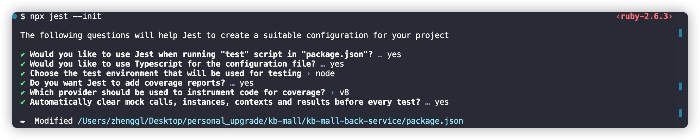
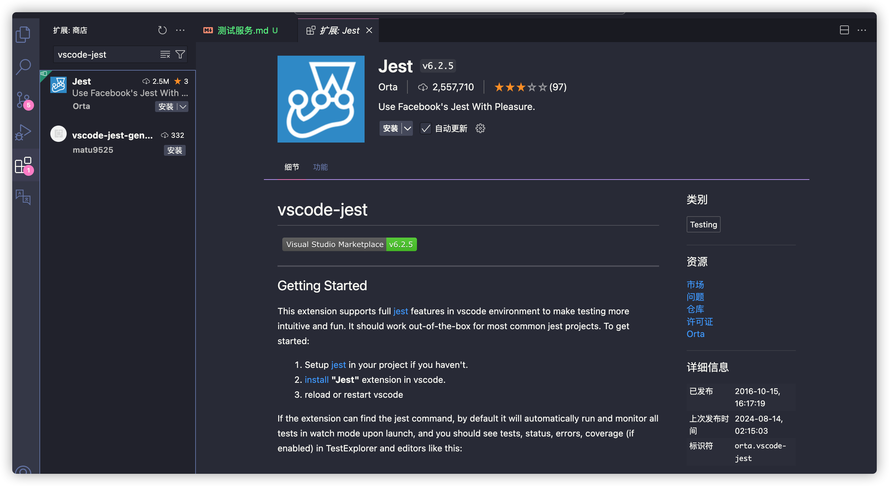
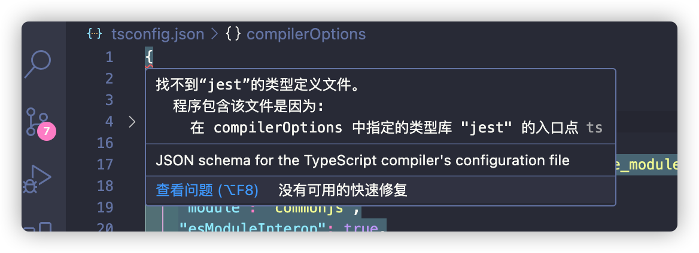
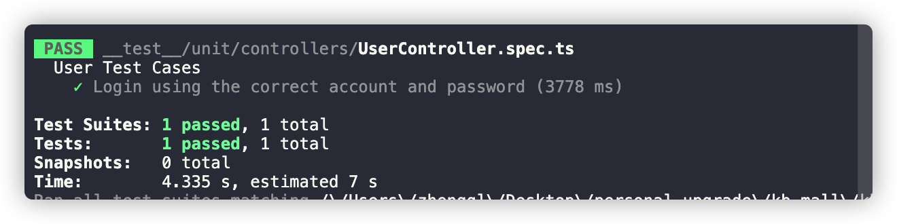
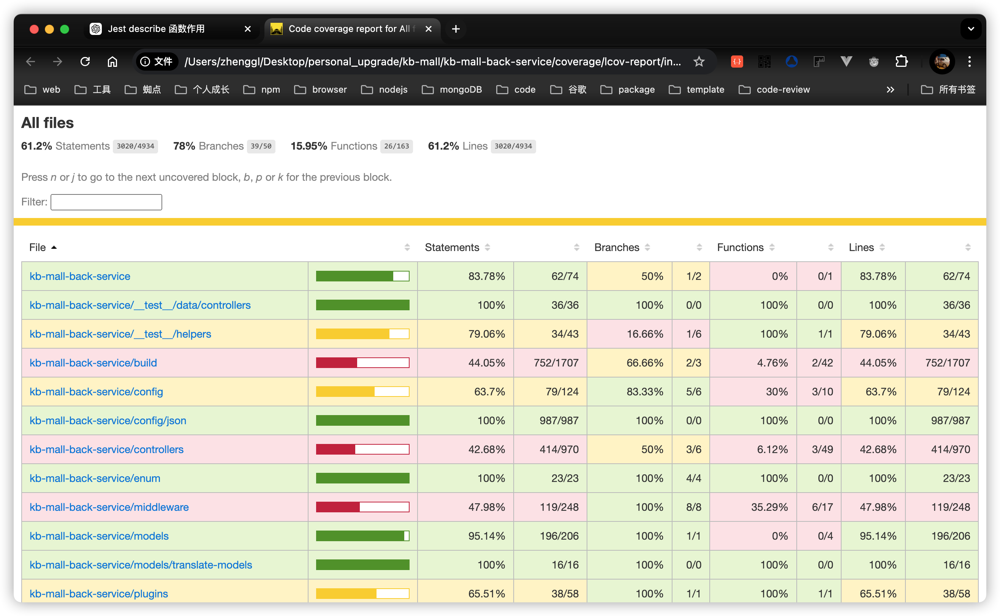

### 测试
---
> 在后端的coding中，经常性地需要编写相关的测试用例，用来验证自己所编写的代码逻辑是否正常，同时也确保自己在日常的业务开发过程中，不回因为修改了局部/全局的代码而导致的其他业务异常的问题，减少可能出现的异常问题，“给自己代码填坑”！
> 因此，这边查阅并学习了相关的资料，决定采用`jest` + `supertest`的三方库来辅助项目的单元测试、集成测试，除了这两者，在实现的过程中，将会引入`数据驱动测试开发`、`需求驱动开发`的相关技能！

### 前言与目标
> 需要在项目中针对自己所编写的代码，主要包括接口(*Controller)与服务(*Service)进行单元测试，以及部分核心工具方法的单元测试，需要实现的目标有：
1. 引入常规的单元测试，提供一种方式，能够让自己比较便捷地进行单元测试代码的编写；
2. 与当下ts项目结合，实现`typescript`单元测试编码；
3. 采用`数据驱动测试开发`的模式，针对不同的业务、不同的场景下进行测试，多角度、多方位来验证自己所编写的代码；
4. 使用`vscode-jest`插件，更好地管理与维护自己所编写的单元测试用例；
5. 尝试接入集成测试，将已经实现的单元测试进行组合，实现集成测试相关功能；
6. 输出测试报告，为后续的CI做基础准备工作；
7. 仅针对测试环境提供测试服务，生产环境不使用此测试服务

### 环境搭建

#### 1. 安装相关的库与依赖
```shell
	pnpm install jest supertest --save-dev
```
:stars: 这个`supertest`主要用来测试`express`框架下的接口是否正常，是否能够正常访问使用，它可以使用到`superagent`的相关api来进行接口的测试，具体使用可见[官网描述](https://github.com/ladjs/supertest)

#### 2. 初始化项目测试服务
```shell
	npx jest --init
```

:trollface: 这里我们采用的清一色的`yes`，实现以下几个操作：
1. 在`package.json`中的`script`节点中添加`test`脚本；
2. 使用`Typescript`来编写对应的测试配置文件；
3. 选择`node`作为我们的测试环境；
4. 添加测试报告；
5. 使用`v8`引擎来作为测试代码覆盖率的服务；
6. 在每一个单元测试开始之前，自动清除模拟调用、实例、测试结果。

#### 3. 在ide中集成管理插件(vscode-jest)


#### 4. 添加TypeScript支持
> 在我们即将要创建出来的测试文件*.ts中，需要添加`TypeScript`的支持，因此，还需要另外安装相关的三方库依赖以及将对应的文件进行到配置文件中

+. 安装依赖库
```shell
pnpm install -save-dev ts-jest @jest/globals
```
:thinking: 关于上述的两个库的描述如下：
1. `ts-jest`: 用于在`Jest`中编译并运行`TypeScript`代码；
2. `@jest/globals`: 用于显示导入`Jest`全局函数，`Jest`作为模块提供的一种方式，允许**只从`Jest`中导入全局的函数和变量，而不直接依赖于全局命名空间**，避免污染全局命名空间

+. 更新`jest.config.ts`
```typescript
import type { Config } from '@jest/types';
const config: Config.InitialOptions = {
  preset: 'ts-jest', // 使用 ts-jest 作为 Jest 的预设
  testEnvironment: 'node', // 运行在 Node.js 环境
  globals: {
    'ts-jest': {
      tsconfig: 'tsconfig.json', // 指定 TypeScript 配置文件
    },
  },
  moduleFileExtensions: ['ts', 'js'], // 支持的文件扩展名
  testMatch: ['**/__tests__/**/*.test.ts', '**/?(*.)+(spec|test).ts'], // 匹配测试文件
};
export default config;
```

+. 配置`tsconfig.json`
```json
{
  "compilerOptions": {},
  "include": ["src/**/*.ts", "tests/**/*.ts"],
  "exclude": ["node_modules"]
}
```
:stars: 这里配置的`types: [jest]`，主要告知`TypeScript`知道`Jest`提供的类型定义，在配置的时候，会有如下的一个提示：

出现这个"找不到`jest`的类型定义文件"错误，通常是因为`TypeScript`无法找到`jest`的类型定义文件，一般是由于项目中没有安装`@types/jest`导致，因此安装好对应的`@types/jest`即可！

+. 开始编写测试文件
:trollface: 这样子之后，才可以在`*.spec.ts`测试文件中来导入对应的函数api来进行测试用例代码的编写
```typescript
import { expect } from '@jest/globals'
expect(xxx).toBe(123)
```

#### 5. 设计并创建相关的测试目录
创建**__test__**目录，作为项目的测试文件代码，并根据当前所设计的目标，创建好队医你过的相关测试文件、测试目录，如下目录结构所示：
```
├─ __test__		// 测试的统一目录
│  ├─ data		// 用于存放所有的测试所需的数据，包括单元测试与集成测试所需的数据
│  │  ├─ controllers	// 针对控制器所存放的测试数据
│  │  │  ├─ ProductControllerData.ts
│  │  │  └─ UserControllerData.ts
│  │  ├─ scenarios		// 针对集成测试所存放的测试数据
│  │  │  ├─ ProductFlowData.ts
│  │  │  └─ UserFlowData.ts
│  │  └─ services			// 针对Service服务层所存放的测试数据
│  │     ├─ ProductServiceData.ts
│  │     └─ UserServiceData.ts
│  ├─ helpers		// 封装的测试公共工具方法集合
│  │  ├─ MockData.spec.ts		// 主要定义一些通用的、可复用的模拟数据，如启动服务的默认配置、通用的用户对象，基础配置等等
│  │  └─ TestUtils.ts		// 存放通用的辅助函数，如数据库连接、清理操作等等
│  ├─ integration		// 集成测试所载的目录
│  │  ├─ ProductFlowSpec.ts
│  │  └─ UserFlow.spec.ts
│  └─ unit			// 单元测试所载的目录
│     ├─ controllers
│     │  ├─ ProductController.spec.ts
│     │  └─ UserController.spec.ts
│     └─ services
│        ├─ ProductService.spec.ts
│        └─ UserService.spec.ts
```

#### 6. 路径访问调整
> 之前项目使用别名路径的方式来访问的文件资源，虽然在`typescript`以及`tsoa`上都通过了，但是到了`jest`的领域，又走不通了，因此，这边决定，将原本的路径别名访问机制铲掉，采用相对路径的方式来访问

#### 7. 新增`.env.test`
> 使用这个`jest`来测试的时候，将默认使用`process.env.NODE === test`，因此，这边创建对应的`.env.test`环境变量来使用！

#### 8. 环境全局加载
> 在开始编写这个单元测试用例的相关代码的时候，思考这样子的一个问题，如果我们是所有的接口都运行在当前的服务中的话，那么是否有一种机制：**仅启动一个服务，然后所有的接口都跑到这个服务上来运行？**
> :point_right: 虽然`jest`通过提供`beforeAll()`的勾子函数给我们，来实现*在文件内所有测试开始之前执行的的勾子函数*，但是我们会有不同的模块，会有不同的接口模块，我们也想让这些不同的模块共享同一个服务来运行！因此采用全局的`globalSetup`以及`globalTearDown`来进行全局的配置，实现方式如下：
```typescript
	// __test__/globals/setup.ts
	import { startService } from "../../index";
	export default async function globalSetup() {
		if(!global.server){
			global.server = await startService()
			console.info('手动全局服务启动完毕')
		}
	}
	// __test__globals/tearDown.ts

	export default async function globalTeardown() {
		if(global.server){
			global.server.close()
			console.info('手动关闭服务了')
		}
	}
```
:star: 通过在`__test__/globals/`目录中创建全局的初始化函数以及全局的销毁函数，让所有的单元测试都共享同一个服务以及数据库连接相关！

:thinking: 要让`jest`能够识别到这个全局方法，需要在对应的`jest.config.ts`中将其进行配置出来，如下代码所示：
```typescript
	// jest.config.ts
	import type {Config} from 'jest';
	const config: Config = {
		globalSetup: './__test__/globals/setup.ts',	// 全局初始化文件路径
		globalTeardown: './__test__/globals/tearDown.ts',	// 全局销毁文件路径
	}
```

#### 9. 调整express应用程序入口代码
> 由于我们是通过`supertest`来使用这个`express`所创建出来的应用的，而且**我们需要在数据加载完成之后，才去启动这个express应用**，因此原本直接执行的`express`应用，无法单纯通过导入并控制其流程，因此，需要对这个`express`应用做一下改造，调整如下：
```typescript
// index.ts
// ... 此处隐藏其他的中间件相关代码
//? 对外提供的手动启动服务方法，主要供单元测试所使用
export const startService = async () => {
	//? 在启动服务之前，连接数据库
	await DbConnection()
	return app.listen(process.env.SERVICE_PORT, () => {
		console.info('手动启动服务了～～')
	})
}

if('test' !== process.env.NODE_ENV){
	startService().catch(err => {
		console.error('服务启动发生错误: ', err)
	})
}
```
:thinking: 这里我们对原本的程序进行的调整，保证在开发/生产环境中的正常开发与运行，将服务的启动以函数的形式对外提供一api方法，然后提供给上述第8步的全局初始化方法`globalSetup()`

:100: 这样子之后，我们就可以保证在进行单元测试之前，公共的统一服务已经连接好数据库并创建出来了！

#### 10. 编写公共的接口请求方法
> 在进行接口的单元测试时，我们是借助于`supertest`来模模拟的客户端请求操作，一般使用可见[官方网站描述]()
```typescript
import request from 'supertest'
import app from '../../index'

/**
 * 通用接口测试方法
 * @param {string} url - 请求的接口地址
 * @param {'get' | 'post' | 'put' | 'delete'} method - 请求方法
 * @param {object} [requestData] - 请求数据
 */
export const testEndPoint = async (
	url: string,
	method: 'get' | 'post' | 'put' | 'delete' | 'patch',
	requestData: object | undefined | string,
) => {
	let response;
	switch(method){
		case 'get':
			response = await request(app).get(url).send()
			break
		case 'post': 
			response = await request(app).post(url).send(requestData)
			break
		case 'put': 
			response = await request(app).put(url).send(requestData)
			break
		case 'delete': 
			response = await request(app).delete(url).send(requestData)
			break
		case 'patch':
			response = await request(app).patch(url).send(requestData)
			break
		default:
			throw new Error('Unsupported HTTP method!')
	}
	return response
}
```
> :warning: 但是，这里我们发现一个问题：**使用postman能否正常请求到接口，然后使用这个`supertest`则提示接口404**，
> 这个是什么情况呢？明明我们也是按照官方的描述来编写对应的接口请求操作了呢，还是报404错误！
> :confounded: 经常排查发现，按照官方的写法，我们所使用的`express`并非同一个实例，这个是什么意思呢？也就是说，在`globalSetup.ts`中所创建出来的服务与直接从`index.ts`中导入的应用并非是同一个，
> 因此，只要确保我们所使用的服务是同一个即可，这里我们可以借助于`global`对象(这个是node环境中的全局对象，有点类似于浏览器中的windows)
> :stars: 调整后的代码如下：
```typescript
import request from 'supertest'
import app from '../../index'

/**
 * 通用接口测试方法
 * @param {string} url - 请求的接口地址
 * @param {'get' | 'post' | 'put' | 'delete'} method - 请求方法
 * @param {object} [requestData] - 请求数据
 */
export const testEndPoint = async (
	url: string,
	method: 'get' | 'post' | 'put' | 'delete' | 'patch',
	requestData: object | undefined | string,
) => {
	let response;
	switch(method){
		case 'get':
			response = await request(global.server).get(url).send()
			break
		case 'post': 
			response = await request(global.server).post(url).send(requestData)
			break
		case 'put': 
			response = await request(global.server).put(url).send(requestData)
			break
		case 'delete': 
			response = await request(global.server).delete(url).send(requestData)
			break
		case 'patch':
			response = await request(global.server).patch(url).send(requestData)
			break
		default:
			throw new Error('Unsupported HTTP method!')
	}
	return response
}
```

### 测试用例编写
> 接下来将进行具体的测试用例的编写，这里可分类两种类型的测试用例，一种是针对接口层面的测试用例，一种是针对抽离出来的service层面的测试用例，在开始进行测试用例编写之前，先介绍一个关于**数据驱动测试**
> `数据驱动测试（Data-Driven Testing）`是一种测试方法，它通过将测试用例与输入数据分离来提高测试的灵活性和可维护性。在这种方法中，测试逻辑是固定的，而不同的输入数据则来自外部源（如数组、文件或数据库），允许一次性执行多个场景，一般有如下三个特点：
1. **提高复用性**: 相同的测试逻辑可以适用于多种输入数据，减少了重复代码;
2. **简化维护**: 只需更新输入数据而无需更改测试逻辑，便于管理和扩展测试用例;
3. **清晰的组织**: 测试用例可以集中管理，方便对不同场景进行分类和管理

:trollface: 在接下来的单元测试中，这边基本上按照*数据驱动测试*的思维来设计并编写对应的测试数据 

#### 一. 单元测试数据源设计

##### 1. 接口测试数据源
> 根据实际运用场景，针对接口层面的单元测试，设计并实现了下述的数据源
```typescript
import { HttpMethod } from "../../enum/http"
import { BaseObjectEntity } from "../../entity/BaseObjectEntity"
/**
 * 请求参数类型
*/
export type RequestType = {
	url: string,
	method: HttpMethod,
	params?: Record<string, any>,
	header?: Record<string, any>,
}
/**
 * 单元测试所需的每个测试数据源的数据结构
*/
export interface UnitTestCaseType {
	description: string,		// 用例描述 
	input: RequestType,			// 请求入参相关
	mockReturnValue?: any,		// 模拟返回结果
	expectedResponse: BaseObjectEntity<any>	// 期望响应结果
}
/**
 * 登录动作的测试用例
*/
export const loginTestCases: Array<UnitTestCaseType> = [
	{
		description: 'Login using the correct account and password',
		input: {
			url: '/user/login',
			method: 'post',
			params: {...validateAccountInfo}
		},
		expectedResponse: {
			status: ResultCode.SUCCESS
		}
	}
]
```
:star2: 简而言之，接口的单元测试，就是一个测试描述、入参，然后是预期的响应接口

##### 2. 单元测试的编写
> 在做好了一系列的准备工作之后，这边以`UserController.spec.ts`中的登录为例，编写如下的接口单元测试用例代码：
```typescript
import { testEndPoint } from "../../helpers/TestUtils";
import { describe, expect, test } from "@jest/globals";
import { loginTestCases } from "../../data/controllers/UserControllerData";

describe('User Test Cases', () => {
	// 新用户注册
	// 忘记密码-> 重置密码
	// 修改密码
	//? 用户登录
	test.each(loginTestCases)('$description', async ({ input, expectedResponse }) => {
		const response = await testEndPoint(input.url, input.method, input.params)
		expect(response.statusCode).toBe(200)
		expect(response.body).toEqual(expect.objectContaining({
			status: expectedResponse.status
		}))
	})
	// 退出登录
	// 账号注销 
})
```
:star2: 这里我们将整个用户模块放在一个`describe`模块中，然后针对每一个接口编写对应的测试用例，通过遍历这个登录操作所需的数据源，借助于`test.each()`api，实现不同场景下的单元测试，这里我们先简单的判断是否包括响应体的属性成员参数即可！
然后运行对应的脚本：
```shell
	pnpm test
```
运行成功后，将会在出现单元测试的结果，如下图所示：

:nerd_face: 至此，我们已经实现了一个基本的接口测试，接下来所要做的就是在实际的业务开发过程中，边编写对应的单元测试，边验证自己所编写代码是否正确！

:+1: 另外，由于我们在项目中采用生成代码覆盖说明文档，成功运行`jest`之后，将会在工作空间目录中创建对应的代码覆盖率说明文档目录`coverage`，访问该文档目录中的`index.html`，将可以看到本次测试的一个代码覆盖情况，如下图所示：


#### 二. 接口测试用例编写(*Controller.spec.ts)
> 以下开始进行具体的接口单元测试的思考与实现！

##### 1. 接口测试用例主要验证什么？
> :thinking: 一般情况下，接口单元测试的主要有来自于以下几个公共方向的要素：
1. **接口响应结果**：一般校验http请求接口响应码是否为成功的(200)、参数异常(400)、服务器错误(500)等等；
2. **请求参数的校验**：验证传递的请求参数是否正确，如果参数有误，应该返回相应的错误码（如 400 Bad Request），并提供详细的错误信息；
3. **返回的数据结构校验**：确认返回的数据结构是否符合接口文档的定义。例如，返回的 JSON 对象是否包含 status、message、data 等字段；
4. **对于异常的处理**：验证异常情况下的处理是否符合预期，例如数据库异常或外部服务不可用时，接口是否返回合适的错误响应。

> :facepunch: 另外地，还可以进行以下可选的要素的校验：
1. **数据库操作的正确性**：针对与数据库交互的接口，需要验证数据库操作是否成功，例如在用户注册时，是否在数据库中插入了正确的数据，可以验证新增、编辑、删除后的数据库中表的状态是否与原来的匹配，可以验证事务操作是否按照预期正确执行并在失败时正确回滚；
2. **业务逻辑执行的正确性**：可以是输入输出的验证，边界条件的测试，模拟依赖行为，比如数据库的依赖行为，验证特定函数的调用，比如函数是否被调用、函数被调用时所携带的参数、函数被调用的次数等等，可以验证业务流程状态的变更

##### 2. 实际的接口用例测试编码实现
> 针对上述第一点的所描述的对接口的要素校验， :thinking: 思考这样子的一个问题：**是否可以将公共的校验进行统一校验，而不用在实际的每个单元测试代码中进行一遍遍的编写？**
> 答案是可以的，下面将进行对应的封装、抽离编码实现：
```typescript
// TestUtils.ts
/**
 * 通用接口测试方法
 * @param {string} url - 请求的接口地址
 * @param {'get' | 'post' | 'put' | 'delete'} method - 请求方法
 * @param {object} [requestData] - 请求数据
 * @param {number} expectedStatus - 该接口预期的业务响应状态 
 */
export const testEndPoint = async (
	url: string,
	method: 'get' | 'post' | 'put' | 'delete' | 'patch',
	requestData: object | undefined | string,
	expectedStatus: number
) => {
	let response = request()
	//? ***************** 以下是公共的校验操作 *****************
	// 接口响应码统一为200
	expect(response.statusCode).toBe(HttpCode.SUCCESS)
	// 响应体内容的校验：统一包含固定的数据结构，一般是包含status、message属性
	expect(response.body).toHaveProperty(['status', 'message'])
	// 业务响应体是否与预期响应结果编码一致
	expect(response.body).toEqual(expect.objectContaining({
		status: expectedStatus
	}))
	// 业务响应体是否与预期响应结果编码一致
	expect(response.body).toEqual(expect.objectContaining({
		status: expectedStatus
	}))
	//? ***************** 公共校验结束 *****************
}
```

**实际的接口校验实现(以用户登录为例子)**
> 在针对`用户登录`这一接口，在公共的接口测试的前提下，额外设计并实现了下述的测试要素：
1. 数据驱动开发：设计了登录成功、密码错误、账号已被注销不同场景下的数据;
2. 针对成功的二次验证：针对成功登录的情况，提供了对于token的生成结果进行校验操作
3. 当然还可以拥有其他更多的校验，具体见下方的相关代码：
```typescript
test.each(loginTestCases)('$description', async ({ input, expectedResponse }) => {
		const response = await testEndPoint(input.url, input.method, input.params, expectedResponse.status)
		if(response.body.status === ResultCode){
			// 针对成功过的情况进行详细的验证
			expect(response.body).toHaveProperty('data')
			const data = response.body.data
			if(data){
				// 登录成功的用户必须拥有登录的token
				expect(data).toHaveProperty('accessToken')
				const decodeInfo = jwt.verify(data.assessToken, process.env.JWT_ACCESS_SECRET as string) as JwtPayload
				expect(decodeInfo).toHaveProperty('id')
			}
			
		}
	})
```

:100: 至此，我们已经实现了一个常见的接口单元测试用例，在后续的编码中，只需要针对业务进行对应的代码编写即可， :star2: 在编写单元测试的过程中，可以反向过来查阅我们之前所编写的代码是否合理，有没有错在漏洞之类的！

#### 三. 服务测试用例编写(*Service.spec.ts)

##### 1. 服务测试用例主要验证什么？

##### 2. 实际的服务测试用例编码实现

### 集成测试

### 知识延伸

#### 接口错误码
> 为方便进行问题的跟踪，项目采用模块化接口处理响应码的机制，将与业务无关的响应码，统一抽离到`ResultCode`枚举中，而将与业务相关的，按照业务模块进行各个模块的划分，如下所示：
| 模块 | 描述 | 区间 |
|---|:---|:---|
| ResultCode | 与业务无关的接口响应码，比如接口存在、权限限制等等 | 999以下 |
| UserCode | 与用户相关的接口响应码 | 100000 ~ 100999 |
| ProductCode | 产品模块相关的接口异常响应码 | 200000 ~ 200999 |
| OrderCode | 订单相关的接口异常响应码 | 300000 ~ 300999 |
| AccountCode | 用户管理相关的接口异常响应码 | 400000 ~ 400999 |
| 待续... |  |  |

:trollface: 通过上述这样子定义之后，我们便可以在实际的项目开发过程中，根据对应的code来进行响应场景的编码实现！