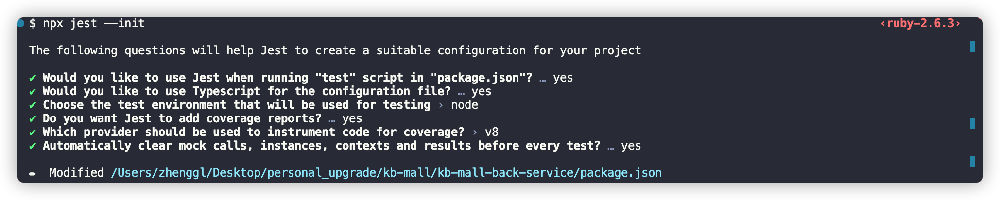
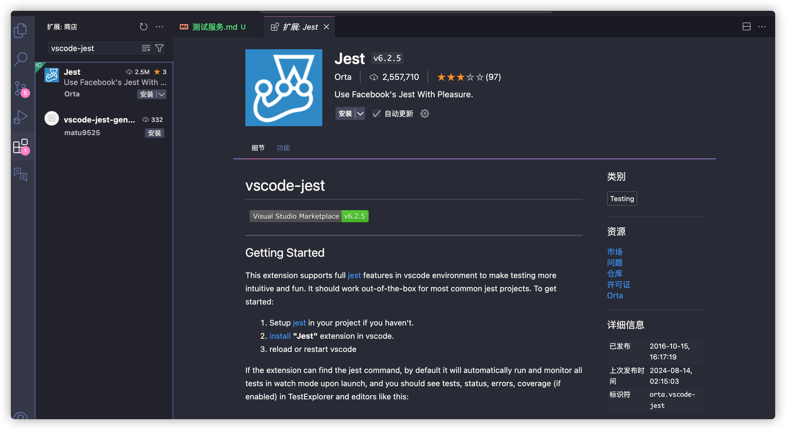
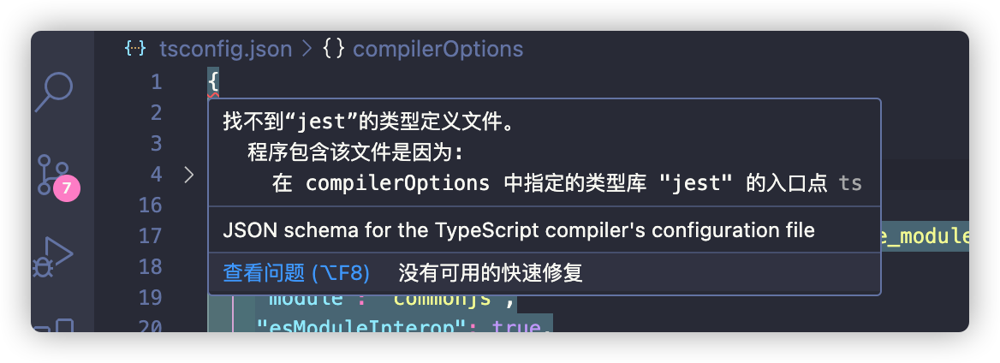

### 测试
---
> 在后端的coding中，经常性地需要编写相关的测试用例，用来验证自己所编写的代码逻辑是否正常，同时也确保自己在日常的业务开发过程中，不回因为修改了局部/全局的代码而导致的其他业务异常的问题，减少可能出现的异常问题，“给自己代码填坑”！
> 因此，这边查阅并学习了相关的资料，决定采用`jest` + `supertest`的三方库来辅助项目的单元测试、集成测试，除了这两者，在实现的过程中，将会引入`数据驱动测试开发`、`需求驱动开发`的相关技能！

### 前言与目标
> 需要在项目中针对自己所编写的代码，主要包括接口(*Controller)与服务(*Service)进行单元测试，以及部分核心工具方法的单元测试，需要实现的目标有：
1. 引入常规的单元测试，提供一种方式，能够让自己比较便捷地进行单元测试代码的编写；
2. 与当下ts项目结合，实现`typescript`单元测试编码；
3. 采用`数据驱动测试开发`的模式，针对不同的业务、不同的场景下进行测试，多角度、多方位来验证自己所编写的代码；
4. 使用`vscode-jest`插件，更好地管理与维护自己所编写的单元测试用例；
5. 尝试接入集成测试，将已经实现的单元测试进行组合，实现集成测试相关功能；
6. 输出测试报告，为后续的CI做基础准备工作；
7. 仅针对测试环境提供测试服务，生产环境不使用此测试服务

### 环境搭建

#### 1. 安装相关的库与依赖
```shell
	pnpm install jest supertest --save-dev
```
:stars: 这个`supertest`主要用来测试`express`框架下的接口是否正常，是否能够正常访问使用，它可以使用到`superagent`的相关api来进行接口的测试，具体使用可见[官网描述](https://github.com/ladjs/supertest)

#### 2. 初始化项目测试服务
```shell
	npx jest --init
```

:trollface: 这里我们采用的清一色的`yes`，实现以下几个操作：
1. 在`package.json`中的`script`节点中添加`test`脚本；
2. 使用`Typescript`来编写对应的测试配置文件；
3. 选择`node`作为我们的测试环境；
4. 添加测试报告；
5. 使用`v8`引擎来作为测试代码覆盖率的服务；
6. 在每一个单元测试开始之前，自动清除模拟调用、实例、测试结果。

#### 3. 在ide中集成管理插件(vscode-jest)


#### 4. 添加TypeScript支持
> 在我们即将要创建出来的测试文件*.ts中，需要添加`TypeScript`的支持，因此，还需要另外安装相关的三方库依赖以及将对应的文件进行到配置文件中

+. 安装依赖库
```shell
pnpm install -save-dev ts-jest @jest/globals
```
:thinking: 关于上述的两个库的描述如下：
1. `ts-jest`: 用于在`Jest`中编译并运行`TypeScript`代码；
2. `@jest/globals`: 用于显示导入`Jest`全局函数，`Jest`作为模块提供的一种方式，允许**只从`Jest`中导入全局的函数和变量，而不直接依赖于全局命名空间**，避免污染全局命名空间

+. 更新`jest.config.ts`
```typescript
import type { Config } from '@jest/types';
const config: Config.InitialOptions = {
  preset: 'ts-jest', // 使用 ts-jest 作为 Jest 的预设
  testEnvironment: 'node', // 运行在 Node.js 环境
  globals: {
    'ts-jest': {
      tsconfig: 'tsconfig.json', // 指定 TypeScript 配置文件
    },
  },
  moduleFileExtensions: ['ts', 'js'], // 支持的文件扩展名
  testMatch: ['**/__tests__/**/*.test.ts', '**/?(*.)+(spec|test).ts'], // 匹配测试文件
};
export default config;
```

+. 配置`tsconfig.json`
```json
{
  "compilerOptions": {
    "types": ["jest"]
  },
  "include": ["src/**/*.ts", "tests/**/*.ts"],
  "exclude": ["node_modules"]
}
```
:stars: 这里配置的`types: [jest]`，主要告知`TypeScript`知道`Jest`提供的类型定义，在配置的时候，会有如下的一个提示：

出现这个"找不到`jest`的类型定义文件"错误，通常是因为`TypeScript`无法找到`jest`的类型定义文件，一般是由于项目中没有安装`@types/jest`导致，因此安装好对应的`@types/jest`即可！

+. 开始编写测试文件
:trollface: 这样子之后，才可以在`*.spec.ts`测试文件中来导入对应的函数api来进行测试用例代码的编写
```typescript
import { expect } from '@jest/globals'
expect(xxx).toBe(123)
```

#### 5. 设计并创建相关的测试目录
创建**__test__**目录，作为项目的测试文件代码，并根据当前所设计的目标，创建好队医你过的相关测试文件、测试目录，如下目录结构所示：
```
├─ __test__		// 测试的统一目录
│  ├─ data		// 用于存放所有的测试所需的数据，包括单元测试与集成测试所需的数据
│  │  ├─ controllers	// 针对控制器所存放的测试数据
│  │  │  ├─ ProductControllerData.ts
│  │  │  └─ UserControllerData.ts
│  │  ├─ scenarios		// 针对集成测试所存放的测试数据
│  │  │  ├─ ProductFlowData.ts
│  │  │  └─ UserFlowData.ts
│  │  └─ services			// 针对Service服务层所存放的测试数据
│  │     ├─ ProductServiceData.ts
│  │     └─ UserServiceData.ts
│  ├─ helpers		// 封装的测试公共工具方法集合
│  │  ├─ MockData.spec.ts		// 主要定义一些通用的、可复用的模拟数据，如启动服务的默认配置、通用的用户对象，基础配置等等
│  │  └─ TestUtils.ts		// 存放通用的辅助函数，如数据库连接、清理操作等等
│  ├─ integration		// 集成测试所载的目录
│  │  ├─ ProductFlowSpec.ts
│  │  └─ UserFlow.spec.ts
│  └─ unit			// 单元测试所载的目录
│     ├─ controllers
│     │  ├─ ProductController.spec.ts
│     │  └─ UserController.spec.ts
│     └─ services
│        ├─ ProductService.spec.ts
│        └─ UserService.spec.ts
```


### 测试用例编写