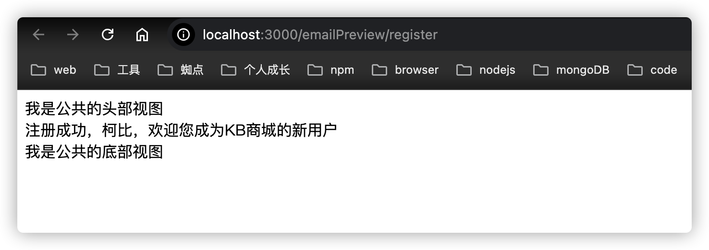

## 邮件发送服务
---

### 前言


### 实现过程
> 下面将整理整个邮件服务的实现过程文档记录

#### 1. 引入三方依赖
> 安装三方发送邮件库: `nodemailer`，可根据业务快速发送邮件动作
```shell
	pnpm i nodemailer
```
关于`nodemailer`的使用，具体见[官网描述](https://nodemailer.com/)

#### 2. 新增统一的邮件服务`EmailSenderService.ts`
```typescript
import Logger from '@/utils/Logger';
// 创建一个 SMTP 传输实例
const transporter = nodemailer.createTransport({
	service: 'gmail',
	auth: {
		user: process.env.GMAIL_ACCOUNT, // 使用环境变量
		pass: process.env.GMAIL_PASSWORD  // 使用环境变量
	}
});
/**
 * 发送邮件的统一动作
 * @param options 发送邮件所需的参数
*/
const send = (options: SendMailOptions) => {
	//? 追加统一的邮件动作
	options.from = process.env.GMAIL_ACCOUNT
	// 发送邮件
	transporter.sendMail(options, (error: Error | null, info) => {
		const msgContent = [
			'[Email Cotent]',
			options.to,
			options.subject,
			options.html,
			options.date
		].join('\n')
		if (error) {
			Logger.error('[Send Email Error]')
			Logger.error(error)
			Logger.error(msgContent)
		} else {
			Logger.debug('[Send Email Success]')
			Logger.info(info.response)
			Logger.error(msgContent)
		}
	});
}
```
通过对`nodemailer`api的简单封装，提供统一的发送邮件api给自己的业务调用，并根据实际业务场景，进行不同场景枚举的设计与方法api的提供，如下代码所示：
```typescript
enum TemplateType {
	WELCOME,
	REGISTER,
	RESET_PWD,
	VALIDATE_ACCOUNT
}
/**
 * 发送注册获取验证码动作
*/
export const sendRegister = async (emailAccount: string) => {
	const html = await loadTemplateByType(TemplateType.REGISTER, { account: emailAccount })
	const options: SendMailOptions = {
		to: emailAccount,
		html,
	}
	send(options)
}
/**
 * 发送欢迎邮件
*/
export const sendWelcomeEmail = async (emailAccount: string) => {
	const html = await loadTemplateByType(TemplateType.WELCOME, { account: emailAccount })
	const options: SendMailOptions = {
		to: emailAccount,
		html,
	}
	send(options)
}

/**
 * 发送忘记密码-重置密码邮件
*/
export const sendResetPwdEmail = async (emailAccount: string) => {
	const html = await loadTemplateByType(TemplateType.RESET_PWD, { account: emailAccount })
	const options: SendMailOptions = {
		to: emailAccount,
		html,
	}
	send(options)
}

/**
 * 发送验证账号有效性的邮件
*/
export const sendRandomCodeEmail = async (emailAccount: string, code: string) => {
	const html = await loadTemplateByType(TemplateType.VALIDATE_ACCOUNT, {code})
	const options: SendMailOptions = {
		to: emailAccount,
		html,
	}
	send(options)
}
```

#### 3. 提供邮件模版引擎的机制，从模版文件中加载字符串和合成结果html
> 由于发送的邮件内容一般是一个html，因此这边借助于模版渲染引擎(ejs)，根据提供的各个模版文件，传递对应的参数化数据，实现目标数据的最终生成，并传递给到对应的业务调用
```typescript
/**
 * 根据模版类型加载对应的模版信息，渲染为对应的html字符串
*/
const loadTemplateByType = async (templateType: TemplateType, data: any) => {
	let fileName = 'welcome'
	switch (templateType) {
		case TemplateType.WELCOME:
			fileName = 'welcome.ejs'
			break
		case TemplateType.REGISTER:
			fileName = 'register.ejs'
			break
		case TemplateType.RESET_PWD:
			fileName = 'reset-pwd.ejs'
			break
		case TemplateType.VALIDATE_ACCOUNT:
			fileName = 'validate-account.ejs'
			break
	}
	const result = await ejs.renderFile(path.join(__dirname, `/template/emails/${fileName}`), data, {})
	if(!result){
		Logger.error('[Render Email Template Error]:')
	}
	return result
}
```

#### 4. 自定义根据环境变量追加模版邮件的调试机制
> 在编码实现这个邮件内容的渲染的时候，编写完成的html需要根据实际的业务数据进行效果展示，这边提供了一个仅针对开发调试阶段有效的配置化机制，进行本地化的效果渲染调试工作，借助于`express`的视图渲染引擎，可在线浏览实际的访问效果，如下代码所示：
```typescript
// index.ts
import { setUpEmailTemplateDebugger } from './middleware/EmailTemplateDebugger'
//? 配置邮件模版调试中间件
setUpEmailTemplateDebugger(app)
// EmailTemplateDebugger.ts
import express, { Express, Request, Response, NextFunction } from "express"
import path from "path"
/**
 * 调试邮件模版的中间件
*/
export const setUpEmailTemplateDebugger = (app: Express) => {
	if (process.env.PREVIEW_EMAIL_TEMPLATE) {
		app.set('view engine', 'ejs')
		app.set('views', path.join(__dirname, 'template'))
		const templateRouter = express.Router()
		templateRouter.get('/validate-account', (req: Request, res: Response, next: NextFunction) => {
			const data = { t: req.t, account: '柯比', code: '888888' }
			res.render('emails/validate-account', data)
		})
		templateRouter.get('/reset-pwd', (req: Request, res: Response, next: NextFunction) => {
			const data = { t: req.t }
			res.render('emails/reset-pwd', data)
		})
		templateRouter.get('/register', (req: Request, res: Response, next: NextFunction) => {
			const data = { t: req.t }
			res.render('emails/register', data)
		})
		app.use('/emailPreview', templateRouter)
	}
}
```
:star: 要支撑到上述的代码的运行，需要在对应的环境变量中添加对应的参数以及添加参数到全局的env类型文件中，如下代码所示
```shell
# 用来发送邮件的个人gmail账号
PREVIEW_EMAIL_TEMPLATE=true
GMAIL_ACCOUNT="kbmjj123@gmail.com"
GMAIL_PASSWORD="这里是隐藏的密码"
```
```typescript
// env.d.ts
declare namespace NodeJS {
	interface ProcessEnv {
		PREVIEW_EMAIL_TEMPLATE: boolean,	// 是否开启预览邮件模版的标识
		GMAIL_ACCOUNT: string,
		GMAIL_PASSWORD: string
	}
}
```
:point_right: 这样子，我们就可以通过访问：[http://localhost:3000/emailPreview/register](http://localhost:3000/emailPreview/register)查看到对应的渲染效果


#### 5. 追加多语言支持
> 由于目前项目是支持多语言的，那么发送的邮件最好也能够根据当前用户的环境进行发送响应的语言邮件，依然借助于这个`req.t`，在提供对应的效应数据的时候，提供相应的邮件内容返回，如下代码所示：
```typescript
templateRouter.get('/register', (req: Request, res: Response, next: NextFunction) => {
			const data = { t: req.t }
			res.render('emails/register', data)
		})
```
:star: 这里我们借助于`req.t`(由之前的`i18next-http-middleware`来提供的)，然后在对应的`*.ejs`文件中直接调用即可，如下代码所示：
```ejs
	<html></html>
	<body>
		<%- include('./include/header') %>
		<div><%= t('template.validateAccount', { account: account, code: code }) %></div>
		<%- include('./include/footer') %>
	</body>
</html>
```
:star: 通过直接调用`t()`函数，并传递对应的语言字符串所对应的key关键词，可以直接在`ejs`中加载对应`locates/**.json`中所定义的语言字符串，还可以通过参数化的方式来进行模版参数的传递，减少自己拼接工作！
